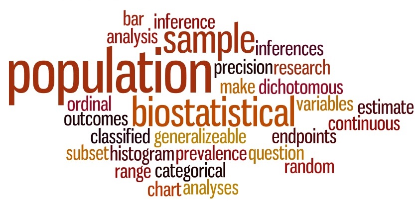
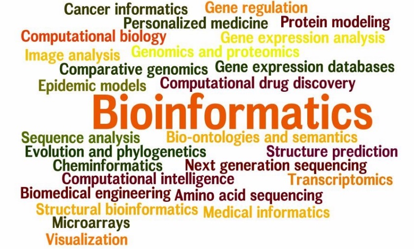
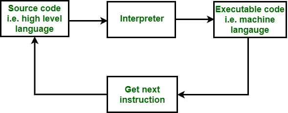

## What is Biostatistics?

Biostatistics is the [application of statistical methods][biostats] to the designing, analyzing, and interpreting of big biological data such as genetic sequences. This requires the development and application of computational algorithms in order to conduct different complex statistical analyses.

{: width="800" }
*[Image source][bioinfoStats]*

The goal of biostatistical analyses are to answer questions and solve problems in a variety of biological fields, ranging from medicine to agriculture. For example, biostaticians are able to use mathematics study the determining factors that impact the health of people in order to arrive at conclusions about disorders and diseases.

> ## Checklist
>
> Some of the common skills required of a biostatician include:
> - experimental design
> - collecting data
> - visualizing data
> - interpreting results
> - computing
> - problem solving
> - critical thinking
> - mathematical statistics
>   - hypothesis testing
>   - multivariate analysis
>   - analysis of correlated data
>   - parameter estimation
>   - probability theory
>   - modeling
{: .checklist}

## What is Bioinformatics?

Bioinfotmatics is a interdisciplinary field that combines techniques and knowledge from both computer science and biology. It is a computational field that involves the analysis of complex genetic data. This commonly includes DNA, RNA, or protein sequence data. 

{: width="800" }
*[Image source][bioinfoStats]*

Bioinformatics data is generated through various omics technologies used to analyze different types of biological molecules. Omics technologies include genetic, transcriptomic, proteomic, and metabolomic data. 

{: width="800" }
*[Image source][omicsInfo]*

Bioinformaticians develop algorithms and use computer programming to investigate the patterns in omics data. For example, it is possible to determine the function of newly sequenced genes by comparing their protein sequences with a database of functionally annotated sequences. More powerfully, different omics data can be combined with other biological data to find complex and subtle relationships.

{: width="800" }
*[Image source][bioinfoInfo]*

> ## Checklist
>
> Some of the common skills requires of bioinformaticians include:
> - mining (collecting) data
> - visualizing data
> - computing
> - problem solving
> - critical thinking
> - omics data analysis
>   - genomics
>   - transcriptomics
>   - proteomics
>   - metabolomics
{: .checklist}

> ## Discussion
>
> What are some of the similarities between the fields of bioinformatics and biostatistics?
>
>> ## Solution
>>
>> Some of the similarities between the two fields are:
>> - colelcting data
>> - visualizing data
>> - computing
>> - problem solving
>> - critical thinking
>{: .solution}
{: .discussion}

## Data Analysis Pipelines

Together bioinformatics and biostatistics are important interdisciplinary fields for those conducting research in a wide variety of biological sciences. A typical bioinformatics or biostatistics data analysis workflow will have multiple steps, which may include:
1. experimental design
2. data collection
3. quality control
4. data preparation
5. statistical analysis of omics data
6. data visualization
7. interpretation of results

The following graphic depicts a general worklfow for preparing, analyzing, and visualzing results from transcriptomic RNA sequencing data. 

{: width="800" }
*[Image source][omicsWorkflow]*

In this workshop you will gain experience in performing different aspects of bioinformatics and biostatistical data analysis by working through a workflow for analyzing gene expression data. The steps in the bioinformatics workflow for this workshop are:
1. data collection - [SRA toolkit][toolkitSRA]
2. quality control - [fastqc][fastqcCite]
3. data preparation
- convert genomic data format - [gffread][gffreadCite]
- align transcriptomic data - [hisat2][hisat2Cite]
- quantify transcript alignments - [featureCounts][featureFiles]
4. basic statistical analysis and visualization (exact tests) - [edgeR][edgeRCite]
5. advanced statistical analysis and visualization (generalized linear models) - [edgeR][edgeRCite]

## Pipelining & The Benefits of Scripting

The primary goal of any bioinformatics analysis workflow is to give meaning to large and complex biological data sets. This often requires the development of code that is generalized and can be automated to run on multiple similar data sets, which may have small differences in their structure or content.

{: width="500" }
*[Image source][scriptingBenefits]*

As we have seen, the analysis of biological data using bioinformatics or biostatistical analysis is often a process that requires multiple steps. Furthermore, these steps often need to be completed in a specific order to achieve a final result. This process involves the output of a previous step being used as input to the subsequent step. This flow of outputs, to inputs, to a final result can be depicted as water flowing from one pipe to the next.

{: width="500" }

By creating a pipeline of scripts, it is possible to automate much of the bioinformatics workflow. This means making modular scripts to perform different steps of the analysis process. 

## BASH Scripting

The coding exercises in this workshop are designed to give you experience with developing and running your own shell scripts using BASH programming. Additionally, you will have a chance to perform statistical analysis using your own R scripts that you run using BASH scripts. These are important skills for anyone interested in developing a bioinformatics script pipeline for analyzing large and complex biological data sets.

{: width="500" }
*[Image source][experienceCite]*

We can use BASH scripting to create modular pieces of code for use in bioinformatics data analysis pipelines. BASH scripts are text files that have the **.sh** file extension. These are text files that you can use to save the lines of BASH code that you want the interpreter componenet of the computer operating system to execute (run).

{: width="800" }
*[Image source][interpreterComp]*

[scriptingBenefits]: https://www.interviewbit.com/shell-scripting-interview-questions/ 
[interpreterComp]: https://www.geeksforgeeks.org/difference-between-assembler-and-interpreter/ 
[bioinfoInfo]: https://www.genomicseducation.hee.nhs.uk/education/core-concepts/what-is-bioinformatics/
[omicsInfo]: https://www.researchgate.net/figure/Overview-of-different-omics-sciences-such-as-genomics-transcriptomics-and-proteomics_fig1_333003279
[biostats]: https://sphweb.bumc.bu.edu/otlt/mph-modules/bs/bs704_biostatisticsbasics/bs704_biostatisticsbasics_print.html
[bioinfoStats]: https://cgm.sjtu.edu.cn/summer_school/
[omicsWorkflow]: https://www.frontiersin.org/articles/10.3389/fbinf.2021.693836/full
[toolkitSRA]: https://trace.ncbi.nlm.nih.gov/Traces/sra/sra.cgi?view=toolkit_doc
[fastqcCite]: https://www.bioinformatics.babraham.ac.uk/projects/fastqc/
[gffreadCite]: http://ccb.jhu.edu/software/stringtie/gff.shtml
[hisat2Cite]: http://daehwankimlab.github.io/hisat2/
[featureFiles]: https://seqan.readthedocs.io/en/master/Tutorial/InputOutput/GffAndGtfIO.html#:~:text=The%20GFF%20and%20GTF%20formats,sometimes%20called%20%E2%80%9CGFF%202.5%E2%80%9D.&text=The%20main%20difference%20is%20the,smaller%20differences%20in%20the%20format.
[edgeRCite]: https://www.bioconductor.org/packages/release/bioc/vignettes/edgeR/inst/doc/edgeRUsersGuide.pdf
[experienceCite]: https://www.abstract.tech/blog/let-people-die-in-virtual-reality


