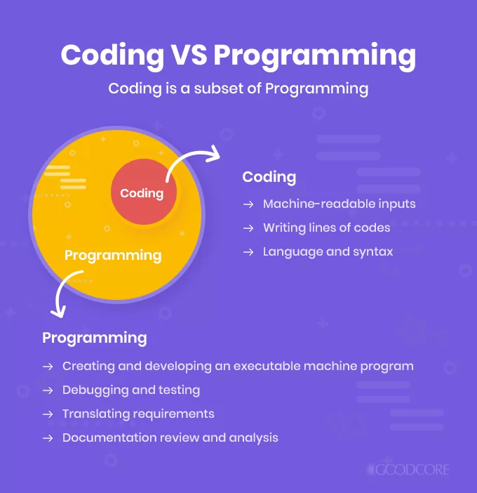
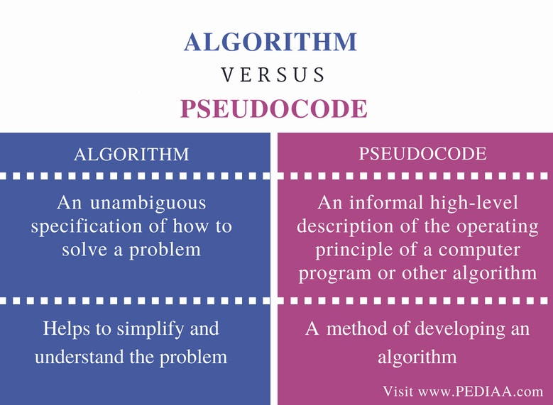
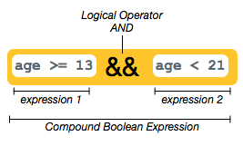
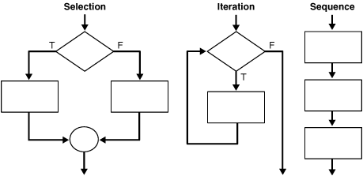
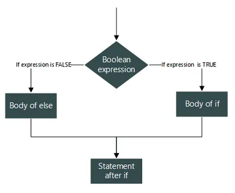
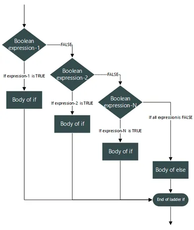

## Introduction
Some of the practical skills required of programmers include the ability to create algorithms, model problems, process data, and manage projects. Many of these same skills are also necessary for the analysis of complex or large biological data sets.

## Programming vs Coding 
Before we begin learning about how to write helpful programs for data analysis, it is important that we consider fundamental concepts and best practices in programming. While sometimes used interchangeably, [programming and coding][codingProgramming] have different definitions. 

{: width="500" }
*[Image source][codingProgramming]*

Based on your personal experiences, let's discuss our current understanding of these important concepts.

> ## Discussion - Programming vs Coding
>
> What is programming?
>
>> ## Solution
>>
>> Programming is the process of creating instructions or set of related activities to achieve a task or goal.
> {: .solution}
>
> What is coding?
>
>> ## Solution
>>
>> Coding is the process of transforming the set of instructions for a process into a written language that a computer can interpret.
> {: .solution}
{: .discussion}

So although programming and coding have different meanings, they are related. The goal of coding is to create the code that acts as a set of computer instructions for a part of a programming project. The goal of programming on the other hand, is to produce programs that are complete and ready to use software products.

## Pseudocode, Code, and Algorithms... Oh My!
Although the differences seem small, there are important distinctions that we can make between the concepts of [pseudocode, code, and algorithms][algorithmPseudocode].

{: width="500" }
*[Image source][algorithmPseudocode]*

Everyone has some experienece with algorithms in their day-to-day life. For example, if you have ever cooked or done some task that requires you to follow instructions with a sequence of steps. 

> ## Discussion - Algorithms
>
> What are algorithms?
>
>> ## Solution
>>
>> Algorithms are the set of step-by-step instructions that explain how to solve a given problem.
> {: .solution}
{: .discussion}

Algorithms need to be represented by some form of language in order to be understood and shared with others. The process of writing pseudocode can be tremendously helpful for figuring out how to start developing code to solve a problem, or implement an algorithm.

> ## Discussion - Pseudocode
>
> What is pseudocode?
>
>> ## Solution
>>
>> Pseudocode is the set of instructions for an algorithm written in a plain language.
> {: .solution}
{: .discussion}

As a first step before you begin developing an algorithm or writing any code, it is a good idea to write out the steps in a plain language. Let's look at an example of pseudocode for a simple algorithm to make tea:

1. Remove a teabag from the package
2. Put the teabag in a cup
3. Boil some water
4. Add the hot water to the cup
5. Allow the tea to steep for 5 minutes
6. Remove the teabag

> ## Challenge - Pseudocode
>
> Write your own pseudocode for an algorithm to make buttered toast.
>> ## Solution
>>
>> 1. Take a slice of bread from the package
>> 2. Place the bread in the toaster
>> 3. Allow the bread to toast for 5 minutes
>> 4. Remove the toasted bread from the toaster
>> 5. Put the toasted bread on a plate
>> 6. Open the container of butter
>> 7. Grab a knife by the handle
>> 8. Dip the kife blade into the butter
>> 9. Apply the butter to the toasted side of the bread
> {: .solution}
{: .challenge}

The primary advantage to using pseudocode in your programming process is that it improves the readability of your algorithms. By first writing algorithms for programs in a plain language, it allows you to break down a complex problem into smaller and more manageable pieces for coding. Furthermore, it gives you the chance to easily identify the most complex and potentially troublesome portions for code development.

## Programming with Logic
A fundamental concept of computer programming, Boolean logic is the mathematical logic underlying Boolean algebra. In Boolean algebra expressions are evaluated to one of two values: TRUE or FALSE. Since an expression may only take on one of two values, Boolean logic is considered "two valued logic".

{: width="500" }
*[Image source][booleanExp]*

Note that an expression is a combination of logical operands and operators. In Boolean logic the operands are statements that can be proven true or false, and the operators are the logical AND, OR and NOT.

> ## Challenge - Boolean Expressions
>
> **1.** What are some examples of simple boolean expressions?
>
>> ## Solution
>>
>> - It is raining
>> - My cat is hungry
>> - The temperature is < 32 degrees Fahrenheit 
>> - Today is NOT Wednesday
> {: .solution}
>
>
> **2.** What are some examples of compound boolean expressions?
>
> **Hint:** 
> Use a combination of the following operators to add complexity to your expressions!
> - Comparison operators (>, <, =, >=, <=, !=)
> - Boolean operators (AND, OR, NOT)
>
>> ## Solution
>>
>> - It is raining AND it is cloudy 
>> - My cat is hungry OR my cat is cute
>> - The temperature is < 32 degrees Fahrenheit AND it is snowing 
>> - Today is NOT Wednesday AND Today is Thursday
> {: .solution}
{: .challenge}

We can combine boolean expressions with control statements to specify how programs will complete a task. Control statments allow you to have flexible outcomes by selecting which pieces of codes are executed, or not. 

## Control Structures

The three primary types of [control structures][controlStructures] are: 
- Sequential statmenetes are executed in the default ordering
- Iterative statements control the number of times a block of code is executed
- Conditional (or selection) statements control which blocks of code are executed, and which are not

{: width="500" }
*[Image source][controlStructures]*

The most common type of control structures are [sequential statements][seqStatements]. These are indicated by code statements written one after another, are are executed line by line. This means that the statements are performed in a top to bottom sequence according to how they are written.

The following is an example of a sequential statement with every-day actions.

**Pseudocode:**
1. Brush teeth 
2. Wash face
3. Comb hair
4. Smile in mirror

> ## Challenge - Sequential Statmenetes
>
> What is an example of pseudocode with a sequential statment using every-day actions or items?
>
>> ## Solution
>>
>> This is an example of pseudocode with the seuqence of actions to tie a shoe.
>>
>> 1. Tie a basic knot
>> 2. Make a loop with one of the laces
>> 3. Use your other hand to wrap the other lace around the loop
>> 4. Pull the shoelace through the hole to form another loop
>> 5. Hold both loops and pull them tight
> {: .solution}
{: .challenge}

Iterative statements allow you to execute the same piece of code a specified number of times, or until a condition is reached. The most common [iterative statements][loopStatements] are defined using either FOR or WHILE loops. Let's start by looking at a flow diagram for a FOR loop, which dipicts the flow of information from inputs to outputs.

{: width="500" }
*[Image source][loopsInR]*

There are many every-day actions that are done repetatively over a range of time, for example.

**Pseudocode:**
1. For each day of the year
- Get up
- Brush teeth
- Wash face
- Comb hair
- Smile in mirror

> ## Challenge - Iterative Statements 1
>
> What is an example of pseudocode with a FOR loop iterative statment using every-day actions or items?
>
> **Hint:** 
> Iterative statements may contain, or be a part of sequential statements.
>
>> ## Solution
>>
>> This is an example of pseudocode wth a FOR loop to brush your teeth.
>>
>> 1. Add toothpaste to toothbrush
>> 2. For each tooth
>> - Brush the outer surface
>> - Brush the inner surface
>> - Brush the chewing surface
>> 3. Brush the tounge surface
>> 4. Rinse with water
> {: .solution}
{: .challenge}

WHILE loops are another type of iterative statement that can be used as a control structure in your code. This type of iterative statement will continue to execute a piece of code until a condition is reached.

{: width="500" }
*[Image source][loopsInR]*

We can also think of some every-day actions that are done repetatively until a certain point. For example, consider the process of braiding bair with a simple braid.

**Pseudocode:**
1. Divide the hair into three even sections 
2. While enough hair remains to weave
- Cross the left section over the middle section
- Cross the right section over the middle section
3. Tie the ends of the sections together with a hair tie

> ## Challenge - Iterative Statements 2
>
> What is an example of pseudocode with a WHILE loop iterative statment using every-day actions or items?
>
> **Hint:** 
> Iterative statements may contain, or be a part of sequential statements or other iterative statements.
>
>> ## Solution
>>
>> This is an example of pseudocode with a WHILE loop to play dodgeball.
>>
>> 1. Gather 3 or more people per team
>> 2. Arrange 1 or more balls at the center of the court
>> 3. Set a timer for 10 minutes
>> 4. Rush to the balls in the center of the court when play begins
>> 5. While untagged players or time remains
>> - Try to dodge balls that the other team throws at you
>> - Throw balls at the other players to get them out
>> 6. Shake hands
> {: .solution}
{: .challenge}

The most common and simple form of [conditional statements][conditionalStatements] are of the IF... THEN form. These are statements that have two parts: hypothesis (if) and conclusion (then). The execution of the conclusion of the statement is conditional upon the state of the hypothesis, which must evaluate to TRUE.

{: width="500" }
*[Image source][ifThenInPython]*

Situations requiring conditional descisions come up all the time in life, for example:

- IF it rains, THEN the ground will be wet
- IF I brush my teeth, THEN I won't get cavities
- IF my coffee = 100 degrees celsius AND I take a sip, THEN I will burn my tounge

> ## Challenge - Conditional Statements 1
>
> What are some examples of simple IF... THEN conditional statments using every-day actions or items?
>
> **Hint:** 
> Use a combination of the following operators to add complexity to your statements!
> - Comparison operators (>, <, =, >=, <=, !=)
> - Boolean operators (AND, OR, NOT)
>
>> ## Solution
>>
>> Here are some examples of every-day conditional statements.
>> 
>> - IF you eat food, THEN you will NOT be hungry
>> - IF it is my birthday AND I want to cry, THEN I will cry
>> - IF my grade < 100 AND my grade > 90, THEN my grade is an A
> {: .solution}
{: .challenge}

The next type of conditional statement adds a level of complexity with the IF... THEN... ELSE format. By adding the ELSE condition to an IF... THEN statement we are able to have alternative conclusions to our hypothesis.

{: width="500" }
*[Image source][ifElseInR]*

The following is an example of an every-day moment that requires a decision with multiple conditional outcomes.

**Pseudocode:**

> ## Challenge - Conditional Statements 2
>
> 
>
> **Hint:** 
> Use multiple ELSE conclusions and a combination of the following operators to add complexity to your statements!
> - Comparison operators (>, <, =, >=, <=, !=)
> - Boolean operators (AND, OR, NOT)
>
>> ## Solution
>>
>> 
> {: .solution}
{: .challenge}

A more advanced type of conditional statement combines multiple IF... THEN... ELSE statements to make a compound statememnt with many alternative outcomes.

{: width="500" }
*[Image source][ifElseInR]*

> ## Challenge - Conditional Statements 3
>
> 
>
>> ## Solution
>>
> {: .solution}
{: .challenge}

### Advanced Concept

An even more advanced concept, nested IF... THEN... ELSE statements can increase the flexability of your code by allowing you to specify more complex conditions.

{: width="500" }
*[Image source][nestedIfElseInR]*

> ## Advanced Challenge 1
> 
> If you are looking for an additional challenge, consider the following nested IF... THEN... ELSE statement:
>
>> ## Solution
>>
> {: .solution}
{: .challenge}

> ## Advanced Challenge 2
>
> What are the outputs of the following sequential and nested conditional statements?
>
>
>
> What are the similarities and differences between these sequential and nested conditional statements?
>
> 
>
>> ## Solution
>>
>> 
> {: .solution}
{: .challenge}

### Final Concept Check
In this lesson we discussed Boolean logic and explored the following control structures:
- Sequential statmenetes
- Iterative statements
- Conditional (or selection) statements

[codingProgramming]: https://www.goodcore.co.uk/blog/coding-vs-programming/
[algorithmPseudocode]: https://pediaa.com/difference-between-algorithm-and-pseudocode/
[booleanExp]: https://curriculum.code.org/csp-18/unit5/9/
[controlStructures]: https://docs.oracle.com/cd/B19306_01/appdev.102/b14261/controlstructures.htm
[conditionalStatements]: https://code.org/curriculum/course2/12/Teacher
[seqStatements]: http://status-twitter.blogspot.com/2013/11/uses-of-sequential-and-compound.html
[loopStatements]: https://www.javatpoint.com/java-for-loop
[loopsInR]: https://www.geeksforgeeks.org/loops-in-r-for-while-repeat/
[ifThenInPython]: https://innovationyourself.com/conditional-statements-in-python/
[ifElseInR]: https://www.datasciencemadesimple.com/if-else-condition-r/
[nestedIfElseInR]: https://www.tutorialgateway.org/nested-if-else-in-r/



