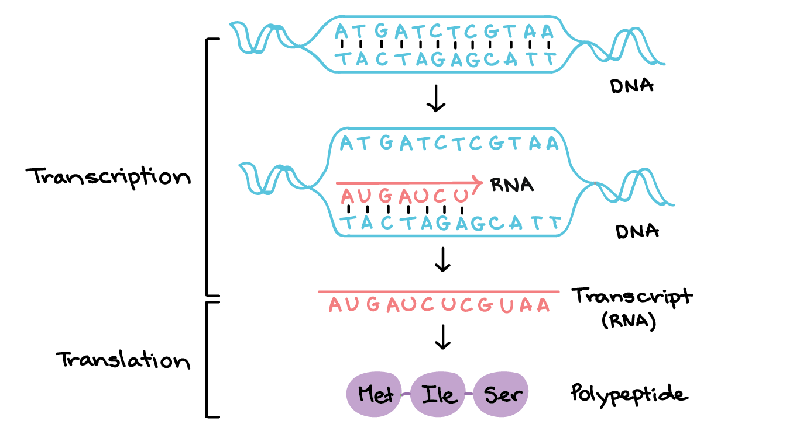
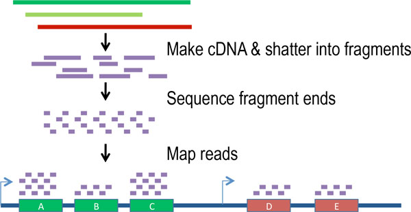
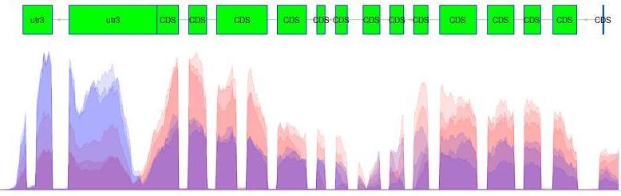
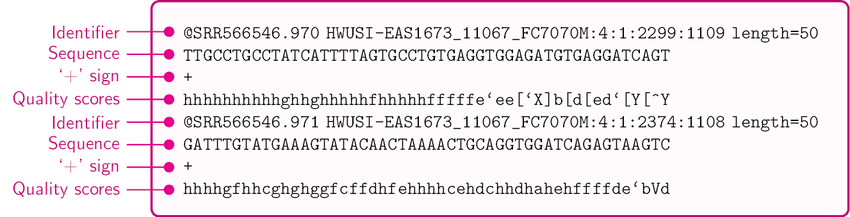
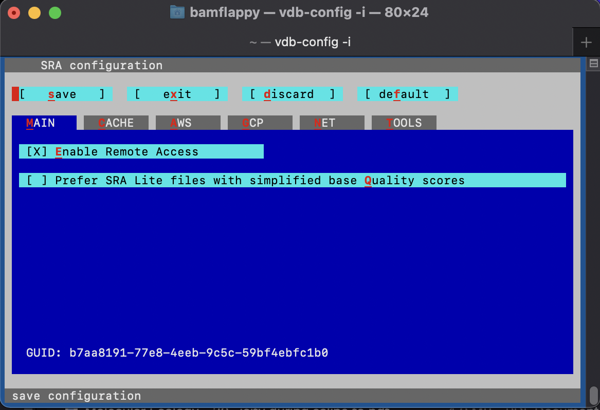
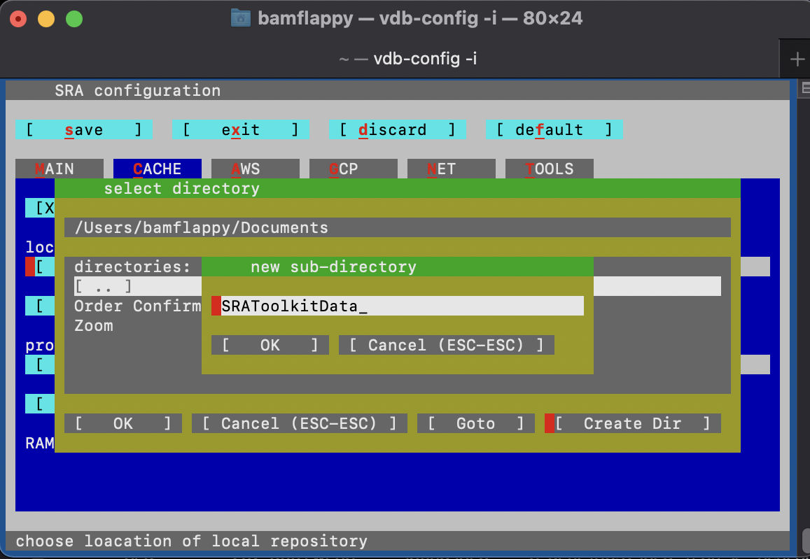
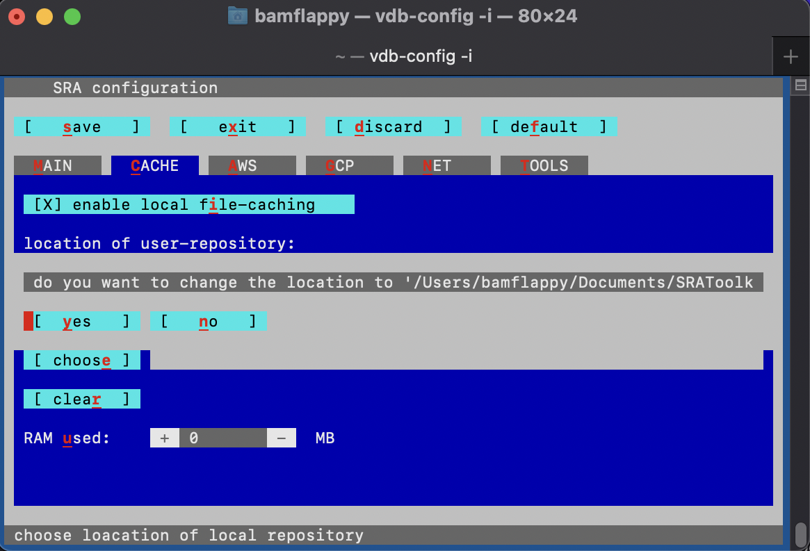
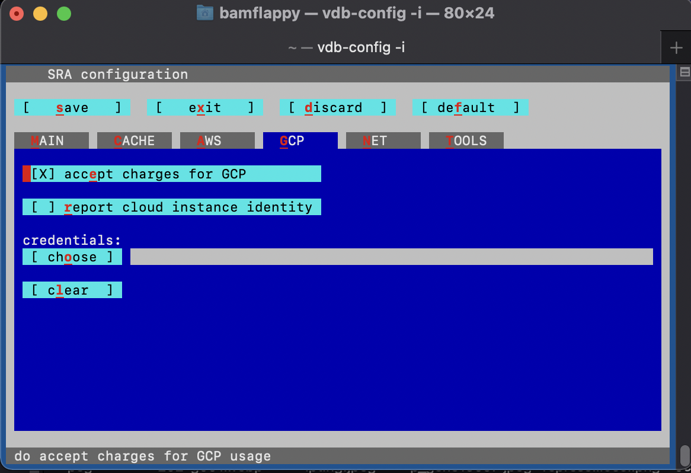
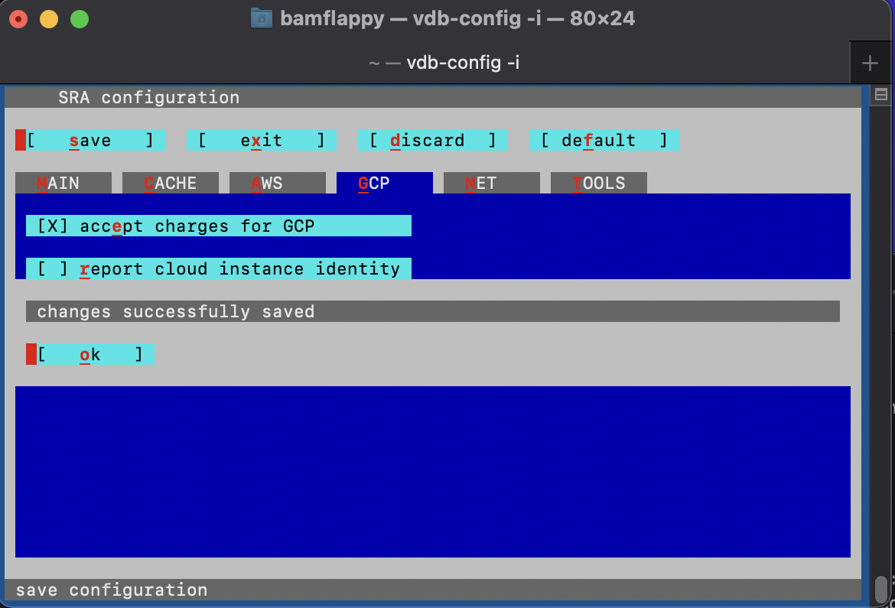

## Study Design & Data Collection

As a first step, we will begin with collecting some data for analysis. In this workshop we will be using data from a study of the effects of ultraviolet (UV) radiation on the larvae of the [red flour beetle][beetleInfo], titled "[Digital gene expression profiling in larvae of *Tribolium castaneum* at different periods post UV-B exposure][paperCite]". 

{: width="500" }
*[Image source][beetleInfo]*

UV radiation is common to many envrioments and it varies in widely in its intensity and composition, such as differing ratios of UV-A and UV-B radiation. The different forms of UV radaition have distinct, and frequently harmful effects on organisms and biological systems. For example, the following diagram depicts the effects of different forms of UV radiation on the skin.

{: width="800" }
*[Image source][radiationEffects]*

UV radiation is considered an important environmental *stressor* that organisms need to defend against. There are three primary methods for defending against UV radiation:
- Avoidance
- Photoprotection
- Repair

Since the red flour beetle (*Tribolium castaneum*) spends much of its life cycle in infested grains, the larvae does not typically experience high levels of UVR. Furthermore, the larvae of the red flour beetle is light in pigmentation and does not appear to employ photoprotective pigments (e.g., melanin) to defend against harmful levels of UV radiation (UVR). 

So, how do the larvae handle any exposure to UV radiation? In their study, the authors investigate the defense strategy against UV-B radiation in the red flour beetle. The following graphical abstract illustrates the design of their study, and how the omics data that we will be using in this workshop was collected.

{: width="800" }
*[Image source][paperCite]*

## What is Gene Transcription?

Before we proceed with our bioinformatics analysis we should consider the data that we will be working with, and how it is collected. In this workshop we will be using several different file types for the various biological data that we will need in the bioinformatics analysis workflow. Remember that omics technologies include genetic, transcriptomic, proteomic, and metabolomic data.

First, we will need to use transcription sequence data. Transcription is the [first step in gene expression][dnaProcesses], which involves copying the DNA sequence of a gene to make a RNA molecule. For a protein-coding gene, the RNA copy (transcript) carries the information needed to build a polypeptide (protein or protein subunit).

{: width="800" }
*[Image source][dnaProcesses]*

The transcription of genes can be measured using *next-generation* sequencing techniques that produces millions of sequences (reads) in a short time. This process depicted in the following schematic representation of a RNA sequencing protocol. 

{: width="800" }
*[Image source][rnaProtocol]*

Transcription can provide whole genome-wide RNA expression profiles, and is useful for identifying key factors influencing transcription in different environmental conditions. For example, consider the following plot of transcription sequence coverage for a gene model (green) in a species of *Daphnia*, which has been subjected to a control of visible light (blue) and treatment of UV radiation (red).

{: width="500" }

As we can see, the coding sequences (CDS) of the predicted gene model are more highlighy expressed in the tratment of UV radiation. This is visible by the red peaks of transcription sequence read coverage, which are showing the higher frequency of sequence reads from the UV treatment matching up (mapping) to the CDS than the visible light sequences.

### Transcriptomic Data Collection

There are several pieces of transcriptomic data that we will need to collect before we can proceed with the bioinformatics analysis. Transcription data are essentially strings of characters in files with very [specific formatting][dataFormatting]. 

In this workshop we will be using transcription sequence data in the [FASTQ format][fastqFormat]. This format stores both biological sequences and their corresponding quality scores. Each sequence typically has the following four lines of information.
- A line beginning with @ followed by a sequence identifier and optional description (comment)
- The raw sequence letters
- A line beginning with +, sometimes followed by the same comment as the first line
- A line encoding the quality values for the sequence in line 2, with the same numbers of symbols as letters in the sequence

{: width="800" }
*[Image source][fastqEx]*

In this workshop we will collect the transcriptomic data we need from the sequence read archive (SRA). Specifically, the transcript sequence data for the paper investigating the effects of UV-B exposure on the larvae of the red flour beetle.

First, we need to install the [SRA Toolkit][toolkitSRA] before we can download the transcriptomic data we need. The SRA Toolkit allows you to retrieve data from the SRA for a specific research project using the associated *accession* number. Additionally, it allows you to produce data file formats like FASTQ using *fastq-dump*, which is one of the command line tools packaged in the SRA Toolkit.

> ## Challenge
>
> To download the SRA toolkit:
> 1. navigate to the [installation instructions][installSRA]
> 2. find the appropriate instructions for your operating system (OS)
> 
>> ## Tips!
>>
>> **Mac OS Installation Tips**
>> *Steps 1 & 2*
>> If you recieve an error when trying to use the *tar* command to unpack the downloaded software, try [adding the *-L* flag][flagFix] like so to the following *curl* command.
>> ~~~
>> curl -L --output sratoolkit.tar.gz http://ftp-trace.ncbi.nlm.nih.gov/sra/sdk/current/sratoolkit.current-mac64.tar.gz
>> ~~~
>> {: .language-bash}
>> 
>> Now you should be able to use the following *tar* command without error:
>> ~~~
>> tar -vxzf sratoolkit.tar.gz
>> ~~~
>> {: .language-bash}
>>
>> *Steps 3 & 4*
>> If you do not recieve the expected similar output of "/Users/JoeUser/sratoolkit.2.4.0-1.mac64/bin/fastq-dump" from the *which fastq-dump* command, make sure that you use *ls* to check the name of the file unpacked by the previous *tar* command. For example:
>> ~~~
>> ls
>> ~~~
>> {: .language-bash}
>>
>> This shows us the files in our current directory, including the following just unpacked file:
>> ~~~
>> sratoolkit.2.11.2-mac64
>> ~~~
>> {: .output}
>>
>> So, this means we need to modify the command in the installation instructions as follows:
>> ~~~
>> export PATH=$PATH:$PWD/sratoolkit.2.11.2-mac64/bin
>> ~~~
>> {: .language-bash}
>>
>> Now, when we run the *which fastq-dump* command we see the desired similar output:
>> ~~~
>> /Users/bamflappy/sratoolkit.2.11.2-mac64/bin/fastq-dump
>> ~~~
>> {: .output}
>>
>> *Step 5*
>> Make sure to run the following configuration command and navigate through the [configuration interface][sraConfig] by proceeding through the instructions.
>> ~~~
>> vdb-config -i
>> ~~~
>> {: .language-bash}
>>
>> This should bring up the following menu:
>> {: width="500" }
>> Where you should make sure to:
>> - enable (mark with X) the "Remote Access" option on the Main screen
>> - move to the "Cache" tab by clicking the tab and and pressing *enter*
>>   - enable "local file-caching"
>>   - set the "Location of user-repository" to an empty folder, which may be a new subdirectory that you can create using the configuration menu:
>> {: width="500" }
>>   - confirm the selected the direcory 
>>   {: width="500" }
>> - go to the "CP" (cloud provider) tab and accept to "report cloud instance identity"
>> {: width="500" }
>> - save your changes to the configuration of the SRA Toolkit software
>> {: width="500" }
>> - you may now exit the configuration menu
>>
>> *Step 6*
>> Now you should be able to run the following command without error:
>> ~~~
>> fastq-dump --stdout SRR390728 | head -n 8
>> ~~~
>> {: .language-bash}
>>
>> And recieve the following output:
>> ~~~
>> @SRR390728.1 1 length=72
>> CATTCTTCACGTAGTTCTCGAGCCTTGGTTTTCAGCGATGGAGAATGACTTTGACAAGCTGAGAGAAGNTNC
>> +SRR390728.1 1 length=72
>> ;;;;;;;;;;;;;;;;;;;;;;;;;;;9;;665142;;;;;;;;;;;;;;;;;;;;;;;;;;;;;96&&&&(
>> @SRR390728.2 2 length=72
>> AAGTAGGTCTCGTCTGTGTTTTCTACGAGCTTGTGTTCCAGCTGACCCACTCCCTGGGTGGGGGGACTGGGT
>> +SRR390728.2 2 length=72
>> ;;;;;;;;;;;;;;;;;4;;;;3;393.1+4&&5&&;;;;;;;;;;;;;;;;;;;;;<9;<;;;;;464262
>> fastq-dump was killed (signal 13 SIGPIPE)
>> ~~~
>> {: .output}
> {: .callout}
{: .challenge}

Now that we have the SRA Toolkit installed we can proceed with collecting the transcriptomic data we need for our bioinformatics analysis. Remeber that we are following the example of the study performed by the authors of "[Digital gene expression profiling in larvae of *Tribolium castaneum* at different periods post UV-B exposure][paperCite]".

> ## Challenge
>
> Let's find the transcriptomic data we need by navigating the internet. This data may be accessed by:
> 1. go to the paper on the publisher's website
>
> 2. search the paper for the SRA "accession" number associated with the study
>
> 3. find the list of accession numbers for the set of transcriptomic data associated with the study by searching for the previously found study accession number using the "[SRA Run Selector][runSelector]" on the NCBI website. It is here you will find futher information about each of the sample files as well.
>
> 4. in order to save time, we will retrieve a subset of the transcriptomic sequence data for the study using the following two SRA accession numbers:
> - SRR8288561
> - SRR8288564
> Note that SRR8288561 is a control sample at 4 hours, and SRR8288564 is a sample subjected to UV-B exposure at 4 hours.
>
> And be sure to use the following [*sam-dump* command format][samDump] from the SRA Toolkit
> ~~~ 
> sam-dump <accession number> --output-file <accession number>.sam
> ~~~
> {: .language-bash}
>
>> ## Tips!
>>
>> The following are some tips to locating the necessary transcriptomic data.
>> 1. A simple way to gain access to a specific publication is by searching the name of a paper using the [Hesburgh Library website][hlWebsite]
>>
>> 2. Search the paper for "accession" (Mac: command+f, Windows: cntrl+f) and copy the *Accession No.* 
>>> ### Solution
>>> The *Accession No.* is PRJNA504739 for the transcriptomic data.
>> {: .solution}
>>
>> 3. To find the list of accession numbers for the transcripts:
>> - enter the accession number you found in the paper in the search box as follows:
>> {: width="500" }
>>
>> 4. Use the following *sam-dump* commands and accession numbers, which will take a few moments:
>> ~~~ 
>> fastq-dump --gzip SRR8288561 
>> fastq-dump --gzip SRR8288562 
>> fastq-dump --gzip SRR8288564
>> fastq-dump --gzip SRR8288567
>> ~~~
>> {: .language-bash}
> {: .callout}
{; .challenge}

In order to access the data stored in these databases you will need to 

However, the data could also be stored locally on a collaborator's computer system. This means you would need to determine another way to access the data, such as through uploading the files to a secure online platform (e.g., [Box][boxCite]).

## Genomic Data Collection

Where you get your genomic data may depend on several factors. For example, some or all of the data that you need may be available through an online database. 

> ## Checklist
>
> These are common online [databases for bioinformatics][databases] analysis:
> - Database of Genomic Structural Variation (dbVar) – insertions, deletions, duplications, inversions, mobile element insertions, translocations, and complex chromosomal rearrangements
> - Database of Genotypes and Phenotypes(dbGaP) - developed to archive and distribute the data and results from studies that have investigated the interaction of genotype and phenotype in Humans
> - Database of Single Nucleotide Polymorphisms (dbSNP) - multiple small-scale variations that include insertions/deletions, microsatellites, and non-polymorphic variants
> - GenBank - the NIH genetic sequence database, an annotated collection of all publicly available DNA sequences
> - Gene - integrates nomenclature, Reference Sequences (RefSeqs), maps, pathways, variations, phenotypes, and links to genome-, phenotype-, and locus-specific from a wide range of species
> - Gene Expression Omnibus (GEO) - a public functional genomics data repository supporting MIAME-compliant data submissions
> - Gene Expression Omnibus Datasets - stores curated gene expression DataSets, as well as original Series and Platform records in the Gene Expression Omnibus (GEO) repository
> - Genome Data Viewer (GDV) - a genome browser supporting the exploration and analysis of more than 380 eukaryotic RefSeq genome assemblies
> - International Genome Sample Resource (IGSR) - from the 1000 Genomes Project that ran between 2008 and 2015, which created the largest public catalogue of human variation and genotype data
> - The Reference Sequence (RefSeq) - a collection that provides a comprehensive, integrated, non-redundant, well-annotated set of sequences, including genomic DNA, transcripts, and proteins
{: .checklist}

Depedning on the organisms that you are working with, you may need to locate data in more organism specific databases. We are working with data for the *Tribolium castaneum* (red flour beetle), which is an arthropod in the order Coleoptera and family Tenebrionidae. So, we are also interested in accessing data from [InsectBase][ibCite].

> ## Challenge
> 
> We will need the genome of the 

## Navigating The Terminal

So, we can use BASH scripting to create modular pieces of code for use in bioinformatics data analysis pipelines. BASH scripts are text files that have the **.sh** file extension. These are text files that you can use to save the lines of BASH code that you want the interpreter componenet of the computer operating system to execute (run).

{: width="800" }
*[Image source][interpreterComp]*

[beetleInfo]: https://entnemdept.ufl.edu/creatures/urban/beetles/red_flour_beetle.htm
[paperCite]: https://www.sciencedirect.com/science/article/pii/S0147651319302684
[radiationEffects]: https://www.mdpi.com/1420-3049/19/5/6202/htm 
[databases]: https://browse.welch.jhmi.edu/datasets/genomic-databases
[boxCite]: https://www.box.com/home
[ibCite]: http://v2.insect-genome.com/
[dnaProcesses]: https://www.khanacademy.org/science/biology/gene-expression-central-dogma/transcription-of-dna-into-rna/a/overview-of-transcription
[rnaProtocol]: https://www.researchgate.net/figure/A-schematic-representation-of-the-RNA-sequencing-protocol_fig1_261205828
[dataFormatting]: https://rnnh.github.io/bioinfo-notebook/docs/file_formats.html
[fastqFormat]: https://support.illumina.com/bulletins/2016/04/fastq-files-explained.html
[fastqEx]: https://www.researchgate.net/figure/A-sample-of-the-FASTQ-file_fig2_309134977
[hlWebsite]: https://www.library.nd.edu/
[toolkitSRA]: https://trace.ncbi.nlm.nih.gov/Traces/sra/sra.cgi?view=toolkit_doc
[installSRA]: https://github.com/ncbi/sra-tools/wiki/02.-Installing-SRA-Toolkit
[flagFix]: https://stackoverflow.com/questions/42268180/tar-unrecognized-archive-format-error-when-trying-to-unpack-flower-photos-tgz
[sraConfig]: https://github.com/ncbi/sra-tools/wiki/03.-Quick-Toolkit-Configuration
[runSelector]: https://www.ncbi.nlm.nih.gov/Traces/study/
[samDump]: https://trace.ncbi.nlm.nih.gov/Traces/sra/sra.cgi?view=toolkit_doc&f=sam-dump


