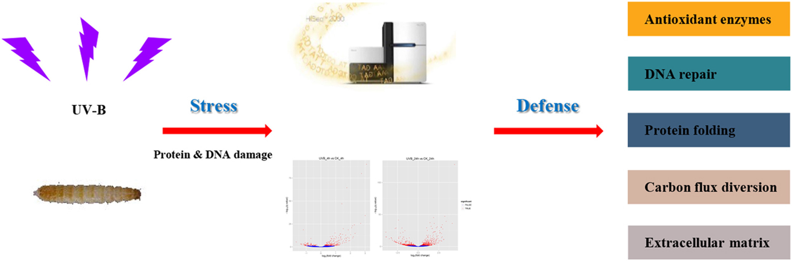

## Study Design & Data Collection

As a first step, we will begin with collecting some data for analysis. In this workshop we will be using data from a study of the effects of ultraviolet (UV) radiation on the larvae of the [red flour beetle][beetleInfo], titled "[Digital gene expression profiling in larvae of *Tribolium castaneum* at different periods post UV-B exposure][paperCite]". 

{: width="500" }
*[Image source][beetleInfo]*

UV radiation is common to many envrioments and it varies in widely in its intensity and composition, such as differing ratios of UV-A and UV-B radiation. The different forms of UV radaition have distinct, and frequently harmful effects on organisms and biological systems. For example, the following diagram depicts the effects of different forms of UV radiation on the skin.

{: width="800" }
*[Image source][radiationEffects]*

UV radiation is considered an important environmental *stressor* that organisms need to defend against. There are three primary methods for defending against UV radiation:
- Avoidance
- Photoprotection
- Repair

Since the red flour beetle (*Tribolium castaneum*) spends much of its life cycle in infested grains, the larvae does not typically experience high levels of UVR. Furthermore, the larvae of the red flour beetle is light in pigmentation and does not appear to employ photoprotective pigments (e.g., melanin) to defend against harmful levels of UV radiation (UVR). 

So, how do the larvae handle any exposure to UV radiation? In their study, the authors investigate the defense strategy against UV-B radiation in the red flour beetle. The following graphical abstract illustrates the design of their study, and how the omics data that we will be using in this workshop was collected.

{: width="800" }
*[Image source][paperCite]*

## What is Gene Transcription?

Before we proceed with our bioinformatics analysis we should consider the data that we will be working with, and how it is collected. In this workshop we will be using several different file types for the various biological data that we will need in the bioinformatics analysis workflow. Remember that omics technologies include genetic, transcriptomic, proteomic, and metabolomic data.

First, we will need to use transcription sequence data. Transcription is the [first step in gene expression][dnaProcesses], which involves copying the DNA sequence of a gene to make a RNA molecule. For a protein-coding gene, the RNA copy (transcript) carries the information needed to build a polypeptide (protein or protein subunit).

{: width="800" }
*[Image source][dnaProcesses]*

The transcription of genes can be measured using *next-generation* sequencing techniques that produces millions of sequences (reads) in a short time. This process depicted in the following schematic representation of a RNA sequencing protocol. 

{: width="800" }
*[Image source][rnaProtocol]*

Transcription can provide whole genome-wide RNA expression profiles, and is useful for identifying key factors influencing transcription in different environmental conditions. This is achieved by processing transcriptomic data through a bioinformatics pipeline similar to the following:

{: width="800" }
*[Image source][deAnalysis]*

For example, consider the following plot of transcription sequence coverage for a gene model (green) in a species of *Daphnia*, which has been subjected to a control of visible light (blue) and treatment of UV radiation (red).

{: width="500" }

As we can see, the coding sequences (CDS) of the predicted gene model are more highlighy expressed in the tratment of UV radiation. This is visible by the red peaks of transcription sequence read coverage, which are showing the higher frequency of sequence reads from the UV treatment matching up (mapping) to the CDS than the visible light sequences.

### Transcriptomic Data Collection

There are several pieces of transcriptomic data that we will need to collect before we can proceed with the bioinformatics analysis. Transcription data are essentially strings of characters in files with very [specific formatting][dataFormatting]. 

In this workshop we will be using transcription sequence data in the [FASTQ format][fastqFormat]. This format stores both biological sequences and their corresponding quality scores. Each sequence typically has the following four lines of information.
- A line beginning with @ followed by a sequence identifier and optional description (comment)
- The raw sequence letters
- A line beginning with +, sometimes followed by the same comment as the first line
- A line encoding the quality values for the sequence in line 2, with the same numbers of symbols as letters in the sequence

{: width="800" }
*[Image source][fastqEx]*

**Note:** Make sure that the [SRA Toolkit][toolkitSRA] is installed before we proceed to download the transcriptomic data we need. To download the SRA toolkit:
1. navigate to the [installation instructions][installSRA]
2. find the appropriate instructions for your operating system (OS)

> ## Software Prerequisite
>
> Further information and tips for installing the SRA toolkit may be found on the [Setup](setup.html) page.
{: .prereq}

The SRA Toolkit allows you to retrieve data from the SRA for a specific research project using the associated *accession* number. Additionally, it allows you to produce data file formats like FASTQ using *fastq-dump*, which is one of the command line tools packaged in the SRA Toolkit.

With the SRA Toolkit installed, we can proceed with collecting the transcriptomic data we need for our bioinformatics analysis. Remeber that we are following the example of the study performed by the authors of "[Digital gene expression profiling in larvae of *Tribolium castaneum* at different periods post UV-B exposure][paperCite]".

> ## Challenge
>
> Let's find the transcriptomic data we need by navigating the internet. This data may be accessed by:
> 1. go to the paper on the publisher's website
>
>> ## Tip! - Task 1
>>
>> A simple way to gain access to a specific publication is by searching the name of a paper using the [Hesburgh Library website][hlWebsite]
> {: .solution}
>
> 2. search the paper for the SRA "accession" number associated with the study
>
>> ## Tip! - Task 2
>>
>> Search the paper for "accession" (Mac: command+f, Windows: cntrl+f) and copy the *Accession No.* 
>>> ### Solution
>>> The *Accession No.* is PRJNA504739 for the transcriptomic data.
>> {: .solution}
>
> 3. find the list of accession numbers for the set of transcriptomic data associated with the study by searching for the previously found study accession number using the "[SRA Run Selector][runSelector]" on the NCBI website. It is here you will find futher information about each of the sample files as well.
>
>> ## Tip! - Task 3
>>
>> To find the list of accession numbers for the transcripts:
>> - enter the accession number you found in the paper in the search box as follows:
>> {: width="500" }
> {: .solution}
>
> *Basic Analysis*
> 4. in order to save time, we will retrieve a subset of the transcriptomic sequence data for the study. Determine the SRA accession numbers for the following samples on the results page:
> - Trc_1
> - Trc_2
> - Trc_4
> - Trc_5
> **Important:** you will need to download at least four of the sample sequence files to run the basic statistical analysis in this workshop.
>
>> ## Tip! - Task 4
>>
>> The four SRA accession numbers are:
>> - SRR8288561
>> - SRR8288562
>> - SRR8288564
>> - SRR8288557
>> Note that the samples called SRR8288561 and SRR8288562 are control samples at 4 hours. Also, note that SRR8288564 and SRR8288557 are treated samples subjected to UV-B exposure at 4 hours.
> {: .solution}
>
> *Advanced Analysis*
> 4. Retrieve the total accession list for the study, which has the SRA accession numbers for all of the samples.
>
>> ## Tip! - Advanced Task 4
>>
>> It is possible to download the full list of SRA accession numbers for all the samples associated with the study by selecting to download the total accession list from the "Select" section of the page.
>> {: width="500" }
> {: .solution}
>
> *Basic Analysis*
> 5. use the following *prefetch* and *fastq-dump* [command formats][samDump] from the SRA Toolkit in the terminal:
> ~~~ 
> prefetch <accession number>
> fastq-dump <accession number> --output-file <accession number>.sam
> ~~~
> {: .language-bash}
>
>> ## Tip! - Task 5
>>
>> Use the following *prefetch* and *fastq-dump* commands and accession numbers, which will take a few moments:
>> ~~~ 
>> prefetch SRR8288561 SRR8288562 SRR8288564 SRR8288557
>> fastq-dump --gzip SRR8288561 
>> fastq-dump --gzip SRR8288562 
>> fastq-dump --gzip SRR8288564
>> fastq-dump --gzip SRR8288557
>> ~~~
> {: .solution}
>
> *Advanced Analysis*
> 5. Retrieve the all of the transcriptomic sequence data for the study using the SRA accession numbers for all of the samples.
>
>> ## Tip! - Advanced Task 5
>>
>> To retrieve the full set of samples, use the following *prefetch* and *fastq-dump* commands and accession numbers. This will take several moments.
>> ~~~ 
>> prefetch SRR8288561 SRR8288562 SRR8288563 SRR8288564 SRR8288557 SRR8288560 SRR8288558 SRR8288559 SRR8288565 SRR8288566 SRR8288567 SRR8288568
>> fastq-dump --gzip SRR8288561; fastq-dump --gzip SRR8288562; fastq-dump --gzip SRR8288563; fastq-dump --gzip SRR8288564; fastq-dump --gzip SRR8288557; fastq-dump --gzip SRR8288560
>> fastq-dump --gzip SRR8288558; fastq-dump --gzip SRR8288559; fastq-dump --gzip SRR8288565; fastq-dump --gzip SRR8288566; fastq-dump --gzip SRR8288567; fastq-dump --gzip SRR8288568
>> ~~~
>> {: .language-bash}
> {: .solution}
{; .challenge}

### Transcriptomic Data Quality Control

An important part of any bioinformatics analysis workflow is the assesment and quality control of your data. In this workshop we are using RNA sequencing reads, which may need to be cleaned if they are *raw* and include extra pieces of unnecessary data (e.g., adapter sequences.

**Note:** be sure that you have installed the [FastQC][fastqcCite] software program before we proceed with the bioinformatics analysis workflow.

> ## Software Prerequisites
>
> Further information and tips for installing the FastQC software may be found on the [Setup](setup.html) page.
{: .prereq}

To check if the transcriptomic data that we downloaded has been cleaned already, we need to use the [FastQC][fastqcCite] bioinformatics software tool. 

> ## Challenge
>
> Let's use the following fastqc command to view the quality of one of the sequence read data sets.
>
> ~~~
> fastqc SRR8288561.fastq.gz --extract
> ~~~
> {: .language-bash}
>
> Note that you can also use the FastQC application to view the quality of transcript data using a user interface.
{: .challenge}

## Genomic Data Collection

Next, we need to collect the neccessary genomic data. Where you get your genomic data may depend on several factors. For example, some or all of the data that you need may be available through an online database. 

> ## Checklist
>
> These are common online [databases for bioinformatics][databases] analysis:
> - Database of Genomic Structural Variation (dbVar) – insertions, deletions, duplications, inversions, mobile element insertions, translocations, and complex chromosomal rearrangements
> - Database of Genotypes and Phenotypes(dbGaP) - developed to archive and distribute the data and results from studies that have investigated the interaction of genotype and phenotype in Humans
> - Database of Single Nucleotide Polymorphisms (dbSNP) - multiple small-scale variations that include insertions/deletions, microsatellites, and non-polymorphic variants
> - GenBank - the NIH genetic sequence database, an annotated collection of all publicly available DNA sequences
> - Gene - integrates nomenclature, Reference Sequences (RefSeqs), maps, pathways, variations, phenotypes, and links to genome-, phenotype-, and locus-specific from a wide range of species
> - Gene Expression Omnibus (GEO) - a public functional genomics data repository supporting MIAME-compliant data submissions
> - Gene Expression Omnibus Datasets - stores curated gene expression DataSets, as well as original Series and Platform records in the Gene Expression Omnibus (GEO) repository
> - Genome Data Viewer (GDV) - a genome browser supporting the exploration and analysis of more than 380 eukaryotic RefSeq genome assemblies
> - International Genome Sample Resource (IGSR) - from the 1000 Genomes Project that ran between 2008 and 2015, which created the largest public catalogue of human variation and genotype data
> - The Reference Sequence (RefSeq) - a collection that provides a comprehensive, integrated, non-redundant, well-annotated set of sequences, including genomic DNA, transcripts, and proteins
{: .checklist}

Depedning on the organisms that you are working with, you may need to locate data in more organism specific databases. We are working with data for the *Tribolium castaneum* (red flour beetle), which is an arthropod in the order Coleoptera and family Tenebrionidae. So, we are also interested in accessing data from [InsectBase][ibCite]. Specifically, we will need:
- reference genome
- genomic features

> ## Tip!
> 
> Navigate to the [*Tribolium castaneum* organism page][tbPage] of the InsectBase website and under the "Download" section of the page:
> 1. click the red word **Genome**
> 2. click the blue word **GFF3**
>
> This will automatically begin downloading each of the necessary genomic data files.
{: .callout}

## Omics Data Preparation - Command Line

Now that we have the necessary transcript and genomic data, we can begin the process of preparing our data for statistical analysis. This will require proceeding through several steps of the bioinformatics workflow. Recall:
1. data collection - SRA toolkit
2. quality control - fastqc
3. data preparation
- convert genomic data format - gffread
- align transcriptomic data - hisat2
- quantify transcript alignments - featureCounts
4. basic statistical analysis and visualization (exact tests) - edgeR
5. advanced statistical analysis and visualization (generalized linear models) - edgeR

**Note:** be sure that you have installed the following software before we proceed with the bioinformatics analysis workflow.
- [Fastqc][fastqcCite]
- [gffread][gffreadCite]
- [Hisat2][hisat2Cite]

> ## Software Prerequisites
>
> Further information and tips for installing the fastqc, gffread, and hisat2 software programs may be found on the [Setup](setup.html) page.
{: .prereq}

### Convert Genomic Data Format

The first step in our bioinformatics workflow is to convert one of the genomic data files to the format expected by our *downstread* analysis tools. The genome features file that we downloaded from InsectBase for *Tribolium castaneum* is in the *gff3* format, but it needs to be in *gtf* format to use with Hisat2. This is because there are some important [formatting differences][featureFiles] between the two genomic feature file types.

> ## Challenge
>
> Let's use the gffread command line tool to convert the genomic features file from *gff3* to *gtf* format.
> **Hint:** check out the [manual page for gffread][gffreadMan] to learn more about the different options.
>
> ~~~
> gffread -E -F -T Tribolium_castaneum.gff3 -o Tribolium.gtf
> ~~~
> {: .language-bash}
{: .challenge}

### Align Transcriptomic Data 

Next, we need to prepare the transcriptomic sequence data files for statistical analysis by aligning the reads to the reference genome. Recall that our RNA sequence analysis workflow involves mapping the shattered reads to a reference genome.

{: width="800" }
*[Image source][rnaMapping]*

> ## Challenge
>
> Let's use the Hisat2 command line tool to map the transcriptomic sequence reads to the reference genome of *Tribolium castaneum*. This is done in two steps.
> **Hint:** check out the [manual page for Hisat2][hisat2Cite] to learn more about the different options.
>
> *Step 1*
> First, we need to build a HISAT2 index from the set of DNA sequences for *Tribolium castaneum* contained in the reference genome *fasta* file. The build files that are produced by running the following command are needed to map the aligned reads to the reference using the hisat2 commands in the next step (*Step 2*).
>
> ~~~
> hisat2-build Tribolium_castaneum.genome.fa TriboliumBuild
> ~~~
> {: .language-bash}
>
> *Step 2*
> Second, we can use the hisat2 command to map **each** read to the reference genome. This results in an output *sam* file for each of the input compressed transcript sequence *fastq.gz* files.
>
> ~~~
> hisat2 -q -x TriboliumBuild -U SRR8288561.fastq.gz -S SRR8288561_accepted_hits.sam
> hisat2 -q -x TriboliumBuild -U SRR8288562.fastq.gz -S SRR8288562_accepted_hits.sam
> hisat2 -q -x TriboliumBuild -U SRR8288563.fastq.gz -S SRR8288563_accepted_hits.sam
> hisat2 -q -x TriboliumBuild -U SRR8288564.fastq.gz -S SRR8288564_accepted_hits.sam 
> hisat2 -q -x TriboliumBuild -U SRR8288557.fastq.gz -S SRR8288557_accepted_hits.sam
> hisat2 -q -x TriboliumBuild -U SRR8288560.fastq.gz -S SRR8288560_accepted_hits.sam
> ~~~
> {: .language-bash}
{: .challenge}

[beetleInfo]: https://entnemdept.ufl.edu/creatures/urban/beetles/red_flour_beetle.htm
[paperCite]: https://www.sciencedirect.com/science/article/pii/S0147651319302684
[radiationEffects]: https://www.mdpi.com/1420-3049/19/5/6202/htm 
[databases]: https://browse.welch.jhmi.edu/datasets/genomic-databases
[ibCite]: http://v2.insect-genome.com/
[dnaProcesses]: https://www.khanacademy.org/science/biology/gene-expression-central-dogma/transcription-of-dna-into-rna/a/overview-of-transcription
[deAnalysis]: https://www.ebi.ac.uk/training/online/courses/functional-genomics-ii-common-technologies-and-data-analysis-methods/rna-sequencing/performing-a-rna-seq-experiment/data-analysis/differential-gene-expression-analysis/
[rnaProtocol]: https://www.researchgate.net/figure/A-schematic-representation-of-the-RNA-sequencing-protocol_fig1_261205828
[dataFormatting]: https://rnnh.github.io/bioinfo-notebook/docs/file_formats.html
[fastqFormat]: https://support.illumina.com/bulletins/2016/04/fastq-files-explained.html
[fastqEx]: https://www.researchgate.net/figure/A-sample-of-the-FASTQ-file_fig2_309134977
[hlWebsite]: https://www.library.nd.edu/
[toolkitSRA]: https://trace.ncbi.nlm.nih.gov/Traces/sra/sra.cgi?view=toolkit_doc
[installSRA]: https://github.com/ncbi/sra-tools/wiki/02.-Installing-SRA-Toolkit
[flagFix]: https://stackoverflow.com/questions/42268180/tar-unrecognized-archive-format-error-when-trying-to-unpack-flower-photos-tgz
[sraConfig]: https://github.com/ncbi/sra-tools/wiki/03.-Quick-Toolkit-Configuration
[runSelector]: https://www.ncbi.nlm.nih.gov/Traces/study/
[samDump]: https://trace.ncbi.nlm.nih.gov/Traces/sra/sra.cgi?view=toolkit_doc&f=sam-dump
[tbPage]: http://v2.insect-genome.com/Organism/768
[fastqcCite]: https://www.bioinformatics.babraham.ac.uk/projects/fastqc/
[gffreadCite]: http://ccb.jhu.edu/software/stringtie/gff.shtml
[hisat2Cite]: http://daehwankimlab.github.io/hisat2/
[featureFiles]: https://seqan.readthedocs.io/en/master/Tutorial/InputOutput/GffAndGtfIO.html#:~:text=The%20GFF%20and%20GTF%20formats,sometimes%20called%20%E2%80%9CGFF%202.5%E2%80%9D.&text=The%20main%20difference%20is%20the,smaller%20differences%20in%20the%20format.
[gffreadMan]: http://manpages.ubuntu.com/manpages/trusty/man1/gffread.1.html
[rnaMapping]: https://www.technologynetworks.com/genomics/articles/rna-seq-basics-applications-and-protocol-299461
[fastqcCite]: https://www.bioinformatics.babraham.ac.uk/projects/fastqc/


