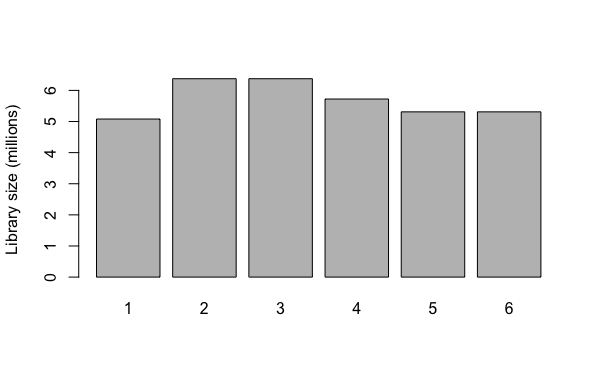
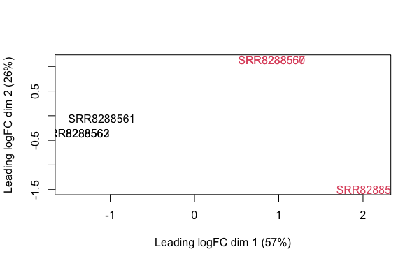
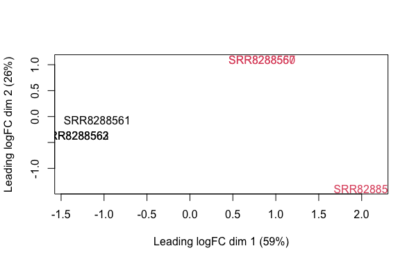
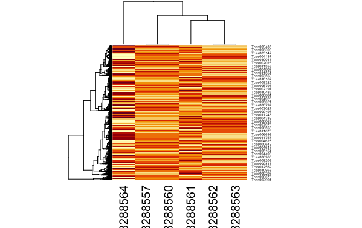
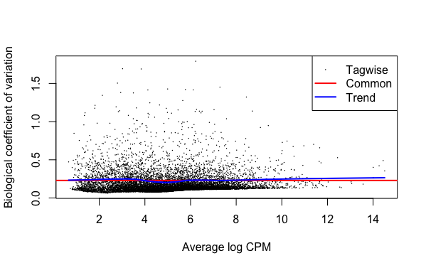
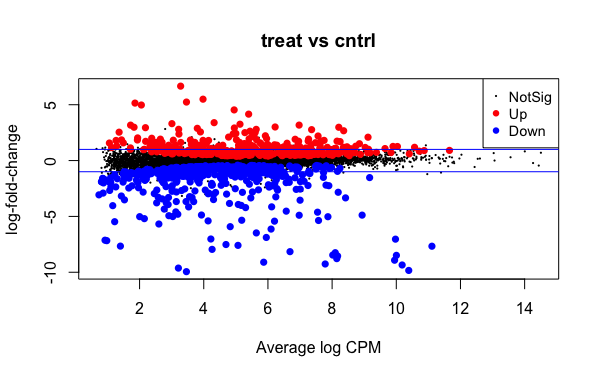
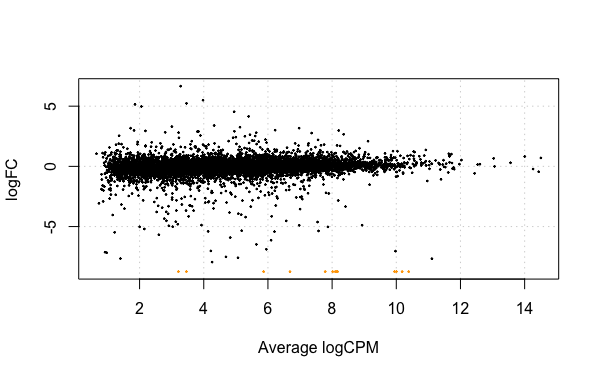

## Omics Data Preparation - R

Now that we have the transcript sequence reads aligned (mapped) to the reference genome, we can begin to quantify the number of reads that map to each genomic feature from the features file. Recall that we are able to count the number of reads that map to each feature in a genome to compare the effects of a treatment, such as UV radiation exposure.

{: width="800" }

A benefit of being able to map transcript reads is the ability to [determine the differential expression][deAnalysis] of genes under stress. Remember that transcripts produced by RNA sequencing technologies are fragments of gene sequences that have been transcribed (expressed).

> ## Scripting & Pipelining Tip!
>
> Remember that the primary benefit of scripting is the ability to save modular pieces of code to re-use later. As a first step to designing a pipeline, it is a good idea to work through a simple example using data. While you are working through the exercises in this workshop, make sure to store the pieces of code that you write to perform each task. 
>
> Recall that the file extension for R scripts is **.r** or **.R**.
>
> **Note:** it is highly recommended that you also write a comment for each piece of code that states why you are using that piece of code. Also, you may wish to leave a comment about the purpose, or what that piece of code does.
{: .callout}

### Coding Challenge

> ## Software Prerequisites
>
> **Note:** be sure that you have loaded the [Rsubread][rsubreadCite] R library before we proceed with the bioinformatics analysis workflow.
>
> Further information and tips for installing the Rsubread R library may be found on the [Setup](setup.html) page.
{: .prereq}

The **featureCounts** function of the Rsubread library allows us to count the number of transcripts that map to each genomic feature in the *Tribolum castaneum* reference genome.

**Note:** the *?* symbol can be prepended (e.g., *?featurecounts*) to most function names in R to retrieve more information about the function.

> ## Tip!
>
> To make the process easier, remember to set your working directory before proceeding with any coding in R.
>
> ~~~
> setwd("/YOUR/WORKSHOP/DIRECTORY/PATH")
> ~~~
> {: .language-r}
>
> Also, remember to load the Rsubread library before you attempt to use the **featureCounts** function.
> ~~~
> library("Rsubread")
> ~~~
> {: .language-r}
{: .callout}

As a first step, we need to quantify (count) the number of transcript sequence reads that have mapped (aligned) to the features of the *Tribolium castaneum* genome.

{: width="800" }
*[Image source][countFig]*

So to quantify the read fragments that map to the genomic features of the red flour beetle genome, we will use the **fetureCounts** function with the output Hisat2 sam files from the previous step of the bioinformatics workflow.

~~~
# control samples at 4h
cntrl1_fc <- featureCounts(files="SRR8288561_accepted_hits.sam", annot.ext="Tribolium.gtf", isGTFAnnotationFile=TRUE)
cntrl2_fc <- featureCounts(files="SRR8288562_accepted_hits.sam", annot.ext="Tribolium.gtf", isGTFAnnotationFile=TRUE)
cntrl3_fc <- featureCounts(files="SRR8288563_accepted_hits.sam", annot.ext="Tribolium.gtf", isGTFAnnotationFile=TRUE)

# treatment samples at 4h
treat1_fc <- featureCounts(files="SRR8288564_accepted_hits.sam", annot.ext="Tribolium.gtf", isGTFAnnotationFile=TRUE)
treat2_fc <- featureCounts(files="SRR8288557_accepted_hits.sam", annot.ext="Tribolium.gtf", isGTFAnnotationFile=TRUE)
treat3_fc <- featureCounts(files="SRR8288560_accepted_hits.sam", annot.ext="Tribolium.gtf", isGTFAnnotationFile=TRUE)
~~~
{: .language-r}

> ## Tip!
> 
> Checkout what the resulting data frames looks like using the **names** and **head** commands. For example:
> 
> ~~~
> names(cntrl1_fc)
> 
> head(cntrl1_fc$counts)
> ~~~
> {: .language-r}
{: .callout}

Before we can move on to any statistical analysis, we need to prepare the data by adding all of the results to a single data frame.

~~~
# prepare data frame of sequence read count data
tribolium_counts <- data.frame(
  SRR8288561 = unname(cntrl1_fc$counts),
  SRR8288562 = unname(cntrl2_fc$counts),
  SRR8288563 = unname(cntrl2_fc$counts),
  SRR8288564 = unname(treat1_fc$counts),
  SRR8288557 = unname(treat2_fc$counts),
  SRR8288560 = unname(treat2_fc$counts)
)

# checkout what the resulting counts data frame looks like
head(tribolium_counts)

# set the row names of the counts data frame using a featureCounts results data frame
rownames(tribolium_counts) <- rownames(cntrl1_fc$counts)

# checkout what the updated counts data frame looks like
head(tribolium_counts)
~~~
{: .language-r}

## Statistical Analysis - Exact Tests

With our transcript sequence data now aligned and quantified, we can begin to perform some statistical analysis of the data. For next generation squencing data (e.g., RNA sequences), it is a common task to identify differentially expressed genes (tags) between two (or more) groups. Exact tests often are a good place to start with differential expression analysis of transcriptomic data sets. These tests are the [classic edgeR approach][edgerMan] to make pairwise comparisons between the groups.

Once negative binomial models are fitted and dispersion estimates are obtained, we can proceed with testing procedures for determining differential expression of the genes in our *Tribolium castaneum* reference genmoe using the **exactTest** function of edgeR. 

**Note:** the exact test is based on the qCML methods. By knowing the conditional distribution for the sum of counts in a group, we can compute exact p-values by summing over all sums of counts that have a probability less than the probability under the null hypothesis of the observed sum of counts. 

> ## Tip!
>
> The exact test for the negative binomial distribution has strong parallels with Fisher’s exact test, and is *only applicable to experiments with a single factor*.
{: .callout}

So, the types of contrasts you can make will depend on the design of your study and data set. The experimental design of the data we are using in this workshopis as follows:

| sample | treatment |
| ------- | ------- |
| SRR8288561 | cntrl |
| SRR8288562 | cntrl |
| SRR8288563 | cntrl |
| SRR8288564 | treat |
| SRR8288557 | treat |
| SRR8288560 | treat |

**Note** in the treatment column:
- cntrl - control treatment
- treat - treatment of UV-B exposure

It is apparent from the above experimental design layout that we are at least able to perform exact tests (t-tests) with the read count (gene expression) data.

After normalization of raw counts we will perform genewise exact tests for differences in the means between two groups of gene counts. Specifically, the two experimental groups of treatment and control for the *Tribolium castaneum* transcript sequence data.

> ## Software Prerequisites
>
> **Note:** be sure that you have loaded the [edgeR][edgeRCite] R library before we proceed with the bioinformatics analysis workflow.
>
> Further information and tips for installing the edgeR R library may be found on the [Setup](setup.html) page.
{: .prereq}

We will use the edgeR library in R with the data frame of transcript sequence read counts from the previous step of the bioinformatics workflow.

> ## Tip!
>
> Remember to load the edgeR library before you attempt to use the following functions.
> ~~~
> library("edgeR")
> ~~~
> {: .language-r}
{: .callout}

First, we need to describe the layout of samples in our transcript sequence read count data frame using a list object.

~~~
# add grouping factor to specify the layout of the count data frame
group <- factor(c("cntrl","cntrl","cntrl","treat","treat","treat"))

# create DGE list object
list <- DGEList(counts=tribolium_counts,group=group)
~~~
{: .language-r}

This is a good point to generate some interesting plots of our input data set before we begin preparing the raw gene counts for the exact test.

So first, we will now plot the library sizes of our sequencing reads before normalization using the **barplot** function.
 
~~~
# plot the library sizes before normalization
barplot(list$samples$lib.size*1e-6, names=1:6, ylab="Library size (millions)")
~~~
{: .language-r}

> ## Plot
>
> {: width="500" }
{: .solution}

Next, we will use the **plotMDS** function to display the relative similarities of the samples and view batch and treatment effects before normalization. 

~~~
# draw a MDS plot to show the relative similarities of the samples
# and to view batch and treatment effects before normalization
plotMDS(list, col=rep(1:6, each=3))
~~~
{: .language-r}

> ## Plot
>
> {: width="500" }
{: .solution}

There is no purpose in analyzing genes that are not expressed in either experimental condition (treatment or control), so raw gene counts are first filtered by expression levels.

~~~
# gene expression is first filtered based on expression levels
keep <- filterByExpr(list)
table(keep)
list <- list[keep, , keep.lib.sizes=FALSE]

# calculate normalized factors
list <- calcNormFactors(list)
normList <- cpm(list, normalized.lib.sizes=TRUE)

# view normalization factors
list$samples
dim(list)
~~~
{: .language-r}

Now that we have normalized gene counts for our samples we should generate the same set of previous plots for comparison.

~~~
# plot the library sizes after normalization
barplot(list$samples$lib.size*1e-6, names=1:6, ylab="Library size (millions)")
 
# draw a MDS plot to show the relative similarities of the samples
# and to view batch and treatment effects after normalization
plotMDS(list, col=rep(1:3, each=3))
~~~
{: .language-r}

> ## Plots
>
> {: width="500" }
>
> {: width="500" }
{: .solution}

It can also be useful to view the moderated log-counts-per-million after normalization using the **cpm** function results with **heatmap**.

~~~
# draw a heatmap of individual RNA-seq samples using moderated
# log-counts-per-million after normalization
logcpm <- cpm(list, log=TRUE)
heatmap(logcpm)
~~~
{: .language-r}

> ## Plot
>
> {: width="500" }
{: .solution}

With the normalized gene counts we can also produce a matrix of pseudo-counts to estimate the common and tagwise dispersions. This allows us to use the **plotBCV** function to generate a genewise biological coefficient of variation (BCV) plot of dispersion estimates.

~~~
# produce a matrix of pseudo-counts and
# estimate common dispersion and tagwise dispersions
list <- estimateDisp(list)
list$common.dispersion

# view dispersion estimates and biological coefficient of variation
plotBCV(list)
~~~
{: .language-r}

> ## Plot
>
> {: width="500" }
{: .solution}

Now, we are ready to perform exact tests with edgeR using the **exactTest** function.

~~~
# perform an exact test for treat vs ctrl
tested <- exactTest(list, pair=c("cntrl", "treat"))

# create results table of differentially expressed (DE) genes
resultsTbl <- topTags(tested, n=nrow(tested$table))$table

# create filtered results table of DE genes
resultsTbl.keep <- resultsTbl$FDR <= 0.05
resultsTblFiltered <- resultsTbl[resultsTbl.keep,]
~~~
{: .language-r}

Using the resulting differentially expressed (DE) genes from the exact test we can view the counts per million for the top genes of each sample.

~~~
# look at the counts-per-million in individual samples for the top genes
o <- order(tested$table$PValue)
cpm(list)[o[1:10],]

# view the total number of differentially expressed genes at a p-value of 0.05
summary(decideTests(tested))
~~~
{: .language-r}

We can also generate a mean difference (MD) plot of the log fold change (logFC) against the log counts per million (logcpm) using the **plotMD** function. DE genes are highlighted and the blue lines indicate 2-fold changes. 

~~~
# plot log-fold change against log-counts per million, with DE genes highlighted
# the blue lines indicate 2-fold changes
plotMD(tested)
abline(h=c(-1, 1), col="blue")
~~~
{: .language-r}

> ## Plot
>
> {: width="500" }
{: .solution}

As a final step, we will produce a MA plot of the libraries of count data using the **plotSmear** function. There are smearing points with very low counts, particularly those counts that are zero for one of the columns.

~~~
# make a mean-difference plot of the libraries of count data
plotSmear(tested)
~~~
{: .language-r}

> ## Plot
>
> {: width="500" }
{: .solution}

[deAnalysis]: https://www.ebi.ac.uk/training/online/courses/functional-genomics-ii-common-technologies-and-data-analysis-methods/rna-sequencing/performing-a-rna-seq-experiment/data-analysis/differential-gene-expression-analysis/
[rsubreadCite]: https://bioconductor.org/packages/release/bioc/html/Rsubread.html
[edgeRCite]: https://www.bioconductor.org/packages/release/bioc/vignettes/edgeR/inst/doc/edgeRUsersGuide.pdf
[countFig]: https://hbctraining.github.io/Intro-to-rnaseq-hpc-O2/lessons/05_counting_reads.html
[edgerMan]: https://www.bioconductor.org/packages/release/bioc/vignettes/edgeR/inst/doc/edgeRUsersGuide.pdf


