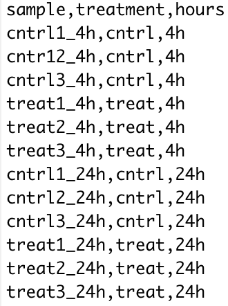

## **Advanced Statistical Analysis Example**

## Omics Data Preparation - R

Now that we have the transcript sequence reads aligned to the reference genome, we can begin to quantify the number of reads that map to each genomic feature from the features file. Recall that we are able to count the number of reads that map to each feature in a genome to compare the effects of a treatment, such as UV radiation exposure.

{: width="800" }

> ## Scripting & Pipelining Tip!
>
> Remember that the primary benefit of scripting is the ability to save modular pieces of code to re-use later. As a first step to designing a pipeline, it is a good idea to work through a simple example using data. While you are working through the exercises in this workshop, make sure to store the pieces of code that you write to perform each task. 
>
> Recall that the file extension for R scripts is **.r** or **.R**.
>
> **Note:** it is highly recommended that you also write a comment for each piece of code that states why you are using that piece of code. Also, you may wish to leave a comment about the purpose, or what that piece of code does.
{: .callout}

### Coding Challenge

> ## Software Prerequisites
>
> **Note:** be sure that you have loaded the [Rsubread][rsubreadCite] R library before we proceed with the bioinformatics analysis workflow.
> 
> Further information and tips for installing the Rsubread R library may be found on the [Setup](setup.html) page.
{: .prereq}

The **featureCounts** function of the Rsubread library allows us to count the number of transcripts that map to each genomic feature in the *Tribolum castaneum* reference genome.

**Note:** the *?* symbol can be prepended (e.g., *?featurecounts*) to most function names in R to retrieve more information about the function.

> ## Tip!
>
> To make the process easier, remember to set your working directory before proceeding with any coding in R.
>
> ~~~
> setwd("/YOUR/WORKSHOP/DIRECTORY/PATH")
> ~~~
> {: .language-r}
>
> Also, remember to load the Rsubread library before you attempt to use the **featureCounts** function.
> ~~~
> library("Rsubread")
> ~~~
> {: .language-r}
{: .callout}

As a first step, we need to quantify (count) the number of transcript sequence reads that have mapped (aligned) to the features of the *Tribolium castaneum* genome.

{: width="800" }
*[Image source][countFig]*

So to quantify the read fragments that map to the genomic features of the red flour beetle genome, we will use the **fetureCounts** function with the output Hisat2 sam files from the previous step of the bioinformatics workflow.

~~~
# control samples at 4h
cntrl1_fc <- featureCounts(files="SRR8288561_accepted_hits.sam", annot.ext="Tribolium.gtf", isGTFAnnotationFile=TRUE)
cntrl2_fc <- featureCounts(files="SRR8288562_accepted_hits.sam", annot.ext="Tribolium.gtf", isGTFAnnotationFile=TRUE)
cntrl3_fc <- featureCounts(files="SRR8288563_accepted_hits.sam", annot.ext="Tribolium.gtf", isGTFAnnotationFile=TRUE)

# treatment samples at 4h
treat1_fc <- featureCounts(files="SRR8288564_accepted_hits.sam", annot.ext="Tribolium.gtf", isGTFAnnotationFile=TRUE)
treat2_fc <- featureCounts(files="SRR8288557_accepted_hits.sam", annot.ext="Tribolium.gtf", isGTFAnnotationFile=TRUE)
treat3_fc <- featureCounts(files="SRR8288560_accepted_hits.sam", annot.ext="Tribolium.gtf", isGTFAnnotationFile=TRUE)

#cntrl samples 24h
cntrl1_fc_24h <- featureCounts(files="SRR8288558_accepted_hits.sam", annot.ext="Tribolium.gtf", isGTFAnnotationFile=TRUE)
cntrl2_fc_24h <- featureCounts(files="SRR8288567_accepted_hits.sam", annot.ext="Tribolium.gtf", isGTFAnnotationFile=TRUE)
cntrl3_fc_24h <- featureCounts(files="SRR8288568_accepted_hits.sam", annot.ext="Tribolium.gtf", isGTFAnnotationFile=TRUE)

#treat samples 24h
treat1_fc_24h <- featureCounts(files="SRR8288559_accepted_hits.sam", annot.ext="Tribolium.gtf", isGTFAnnotationFile=TRUE)
treat2_fc_24h <- featureCounts(files="SRR8288565_accepted_hits.sam", annot.ext="Tribolium.gtf", isGTFAnnotationFile=TRUE)
treat3_fc_24h <- featureCounts(files="SRR8288566_accepted_hits.sam", annot.ext="Tribolium.gtf", isGTFAnnotationFile=TRUE)
~~~
{: .language-r}

> ## Tip!
> 
> Checkout what the resulting data frames looks like using the **names** and **head** commands. For example:
> 
> ~~~
> names(cntrl1_fc)
> 
> head(cntrl1_fc$counts)
> ~~~
> {: .language-r}
{: .callout}

Before we can move on to any statistical analysis, we need to prepare the data by adding all of the results to a single data frame.

~~~
# prepare data frame of sequence read count data
tribolium_counts <- data.frame(
  SRR8288561 = unname(cntrl1_fc_4h$counts),
  SRR8288562 = unname(cntrl2_fc_4h$counts),
  SRR8288563 = unname(cntrl2_fc_4h$counts),
  SRR8288558 = unname(cntrl1_fc_24h$counts),
  SRR8288567 = unname(cntrl2_fc_24h$counts),
  SRR8288568 = unname(cntrl2_fc_24h$counts),
  SRR8288564 = unname(treat1_fc_4h$counts),
  SRR8288557 = unname(treat2_fc_4h$counts),
  SRR8288560 = unname(treat2_fc_4h$counts),
  SRR8288559 = unname(treat1_fc_24h$counts),
  SRR8288565 = unname(treat2_fc_24h$counts),
  SRR8288566 = unname(treat2_fc_24h$counts)
)

# checkout what the resulting counts data frame looks like
head(tribolium_counts)

# set the row names of the counts data frame using a featureCounts results data frame
rownames(tribolium_counts) <- rownames(cntrl1_fc$counts)

# checkout what the updated counts data frame looks like
head(tribolium_counts)
~~~
{: .language-r}

## Advanced Statistical Analysis - Generalized Linear Models

Generalized linear models (GLM) are a classic method for analyzing RNA-seq expression data. In contrast to exact tests, GLMs allow for more general comparisons. As usual, the types of comparisons you can make will depend on the design of your study. In our case:

| sample | treatment | hours |
| ------- | ------- | ------- |
| SRR8288561 | cntrl | 4h |
| SRR8288562 | cntrl | 4h |
| SRR8288563 | cntrl | 4h |
| SRR8288564 | cntrl | 4h |
| SRR8288557 | cntrl | 4h |
| SRR8288560 | treat | 4h |
| SRR8288558 | cntrl | 24h |
| SRR8288567 | cntrl | 24h |
| SRR8288568 | cntrl | 24h |
| SRR8288559 | treat | 24h |
| SRR8288565 | treat | 24h |
| SRR8288566 | treat | 24h |

**Note** in the treatment column:
- cntrl - control treatment
- treat - treatment of UV-B exposure

So, from the above experimental design layout that we can see that we have the ability to perform an ANOVA like tests using generalized linear models with the read count (gene expression) data.

After normalization of the raw gene counts we will perform genewise quasi-likelihood (QL) F-tests using GLMs in edgeR. These tests allow us to perform ANOVA like tests for differences in the means within and between our grouping factors.

The hypotheses we will be testing:
- the means of the treatment factor are equal
- the means of the hours factor are equal
- there is no interaction between the two factors

Note that, we choose to use QL F-tests over likelihood ratio tests (LRT) since it maintains the uncertainty in estimating the dispersion for each gene.

> ## Tip!
>
> Since we have a more complicated experimental design layout, we will be using a csv file to specify the design.
>
> ~~~
> targets <- read.csv(file="groupingFactors.csv")
> ~~~
> {: .language-r}
>
> The **groupingFactors.csv** file has the following layout.
> {: width="250" }
{: .callout}

We will use the edgeR library in R with the data frame of transcript sequence read counts from the previous step of the bioinformatics workflow.

> ## Tip!
>
> Remember to load the edgeR library before you attempt to use the following functions.
> ~~~
> library("edgeR")
> ~~~
> {: .language-r}
 {: .callout}

 First, we need to setup the design matrix describing the experimental design layout of the study.

~~~
# setup a design matrix
group <- factor(paste(targets$treatment,targets$hours,sep="."))
#cbind(targets,Group=group)
~~~
{: .language-r}

The grouping factors need to be added as a column to our experimental design before we can create a DGE list object. Here we use **paste** and **factor** to combine the factors (treatment and hours) into one string (group) separated by a period for each sample.

~~~
# create DGE list object
head(list)
list <- DGEList(counts=tribolium_counts,group=group)
colnames(list) <- rownames(targets)
head(list)
~~~
{: .language-r}

This is a good point to generate some interesting plots of our input data set before we begin preparing the raw gene counts for the exact test.
So first, we will now plot the library sizes of our sequencing reads before normalization using the **barplot** function.

~~~
# plot the library sizes before normalization
barplot(list$samples$lib.size*1e-6, names=1:12, ylab="Library size (millions)")
~~~
{: .language-r}

> ## Plot
>
> {: width="500" }
{: .solution}

Next, we need to filter the raw gene counts by expression levels and remove counts of lowly expressed genes.

~~~
#Retain genes only if it is expressed at a minimum level
keep <- filterByExpr(list)
summary(keep)
list <- list[keep, , keep.lib.sizes=FALSE]
~~~
{: .language-r}

The filtered raw counts are then normalized with **calcNormFactors** according to the weighted trimmed mean of M-values (TMM) to eliminate composition biases between libraries. The normalized gene counts are output in counts per million (CPM).

~~~
#Use TMM normalization to eliminate composition biases
# between libraries
list <- calcNormFactors(list)
#list$samples
#Write normalized counts to file
normList <- cpm(list, normalized.lib.sizes=TRUE)
~~~
{: .language-r}

Now that we have normalized gene counts for our samples we should generate some informative plots of our normalized data. First, we can verify the TMM normalization with a mean difference (MD) plot of all log fold change (logFC) against average count size.

~~~
#Verify TMM normalization using a MD plot
#Write plot to file
plotMD(cpm(list, log=TRUE), column=1)
abline(h=0, col="red", lty=2, lwd=2)
~~~
{: .language-r}

> ## Plot
>
> {: width="500" }
{: .solution}

Next, we will use **plotMDS** to display the relative similarities of the samples and view the differences between the expression profiles of different samples. 

> ## Tips!
>
> A few things to keep in mind:
> - a legend is added to the top left corner of the plot by specifying "topleft" in the **legend** function. The location of the legend may be changed by updating the first argument of the function.
> - the data frames of the points and colors will need to be updated if you have a different number of sample sets than in our example. These data frames are used to set the **pch** and **col** arguments of the **plotMDS** function.
{: .callout}

~~~
#Use a MDS plot to visualizes the differences
# between the expression profiles of different samples
points <- c(0,1,2,3)
colors <- rep(c("blue", "darkgreen"), 2)
#Write plot without legend to file
plotMDS(list, col=colors[group], pch=points[group])
#Write plot with legend to file
plotMDS(list, col=colors[group], pch=points[group])
legend("topleft", legend=levels(group), pch=points, col=colors, ncol=2)
~~~
{: .language-r}

> ## Plots
>
> {: width="500" }
>
> {: width="500" }
{: .solution}

The design matrix for our data also needs to be specified before we can perform the F-tests. The experimental design is parametrized with a one-way layout and one coefficient is assigned to each group.

~~~
#The experimental design is parametrized with a one-way layout, 
# where one coefficient is assigned to each group
design <- model.matrix(~ 0 + group)
colnames(design) <- levels(group)
#design
~~~
{: .language-r}

With the normalized gene counts and design matrix we can now generate the negative binomial (NB) dispersion estimates using the **estimateDisp** function. The NB dispersion estimates reflect the overall biological variability under the QL framework in edgeR. This allows us to use the plotBCV function to generate a genewise biological coefficient of variation (BCV) plot of dispersion estimates. 

~~~
#Next, the NB dispersion is estimated
list <- estimateDisp(list, design, robust=TRUE)
#list$common.dispersion
#Visualize the dispersion estimates with a BCV plot
#Write plot to file
plotBCV(list)
~~~
{: .language-r}

> ## Plot
>
> {: width="500" }
{: .solution}

Next, we estimate the QL dispersions for all genes using the **glmQLFit** function. This detects the gene-specific variability above and below the overall level. The dispersion are then plotted with the **plotQLDisp** function.

~~~
#Now, estimate and plot the QL dispersions
fit <- glmQLFit(list, design, robust=TRUE)
#head(fit$coefficients)
#Write plot to file
plotQLDisp(fit)
~~~
{: .language-r}

> ## Plot
>
> {: width="500" }
{: .solution}

Now we are ready to begin defining and testing contrasts of our experimental design. The first comparison we will make is used to test our hypothesis that the means of the *treatment* factor are equal.

We can use the **glmTreat** function to filter out genes that have a low logFC and are therefore less significant to our analysis. In this example we will use a log2 FC cutoff of 1.2, since we see a relatively large number of DE genes from our test. The DE genes in our test are plotted using the **plotMD** function. 

~~~
#Test whether the average across all cntrl groups is equal to the average across
#all treat groups, to examine the overall effect of treatment
con.treat_cntrl <- makeContrasts(set.treat_cntrl = (treat.4h + treat.24h)/2
                                                    - (cntrl.4h + cntrl.24h)/2,
                                                    levels=design)

#Look at genes with significant expression across all UV groups
anov.treat_cntrl <- glmTreat(fit, contrast=con.treat_cntrl, lfc=log2(1.2))
summary(decideTests(anov.treat_cntrl))
#Write plot to file
plotMD(anov.treat_cntrl)
abline(h=c(-1, 1), col="blue")
~~~
{: .language-r}

> ## Plot
>
> {: width="500" }
{: .solution}

The second comparison we will make is used to test our hypothesis that the means of the *hours* factor are equal.

~~~
#Test whether the average across all tolerant groups is equal to the average across
#all not tolerant groups, to examine the overall effect of tolerance
con.24h_4h <- makeContrasts(set.24h_4h = (cntrl.24h + treat.24h)/2
                                          - (cntrl.4h + treat.4h)/2,
                                          levels=design)

#Look at genes with significant expression across all UV groups
anov.24h_4h <- glmTreat(fit, contrast=con.24h_4h, lfc=log2(1.2))
summary(decideTests(anov.24h_4h))
#Write plot to file
plotMD(anov.24h_4h)
abline(h=c(-1, 1), col="blue")
~~~
{: .language-r}

> ## Plot
>
> {: width="500" }
{: .solution}

The final comparison we will make is to test our hypothesis that there is no *interaction* between the two factors (treatment and tolerance).  To make our last contrast we will test whether the mean effects of the two factors are equal. 

~~~
#Test whether there is an interaction effect
con.interaction <- makeContrasts(set.interaction = ((treat.4h + treat.24h)/2
                                                    - (cntrl.4h + cntrl.24h)/2)
                                                    - ((cntrl.24h + treat.24h)/2
                                                    - (cntrl.4h + treat.4h)/2),
                                                    levels=design)

#Look at genes with significant expression
anov.interaction <- glmTreat(fit, contrast=con.interaction, lfc=log2(1.2))
summary(decideTests(anov.interaction))
#Write plot to file
plotMD(anov.interaction)
abline(h=c(-1, 1), col="blue")
~~~
{: .language-r}

> ## Plot
>
> {: width="500" }
{: .solution}

[rsubreadCite]: https://bioconductor.org/packages/release/bioc/html/Rsubread.html
[edgeRCite]: https://www.bioconductor.org/packages/release/bioc/vignettes/edgeR/inst/doc/edgeRUsersGuide.pdf
[countFig]: https://hbctraining.github.io/Intro-to-rnaseq-hpc-O2/lessons/05_counting_reads.html


