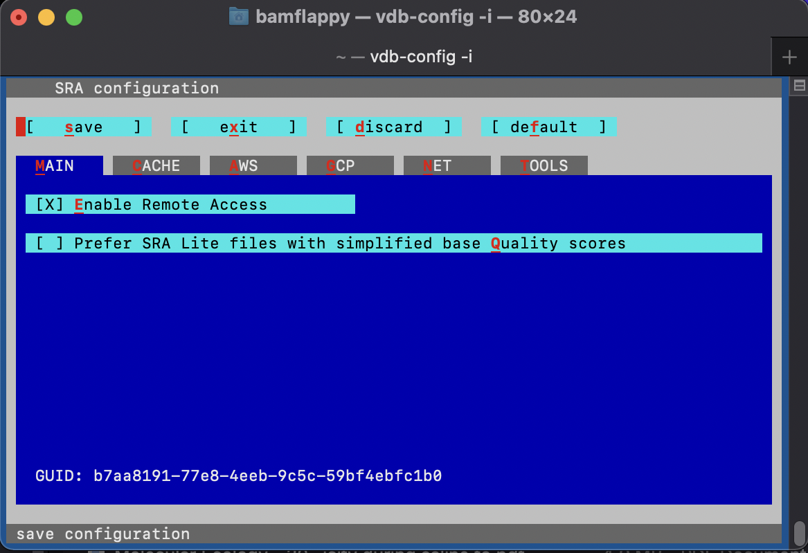
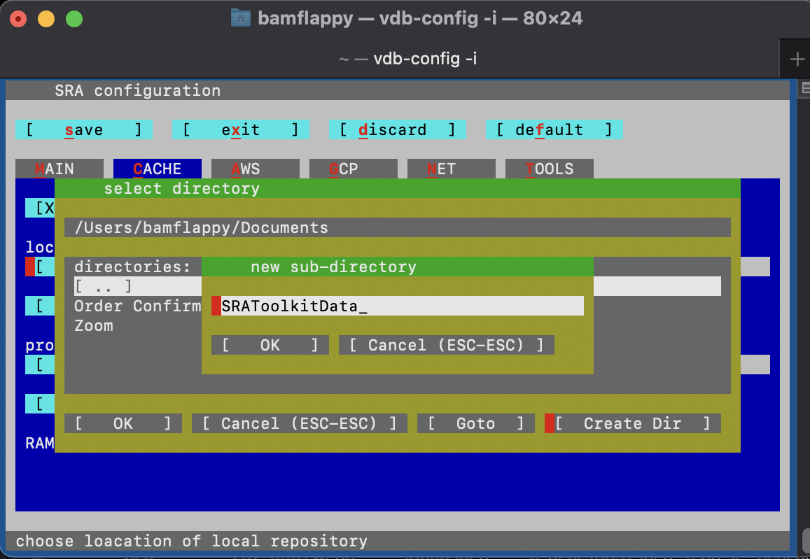
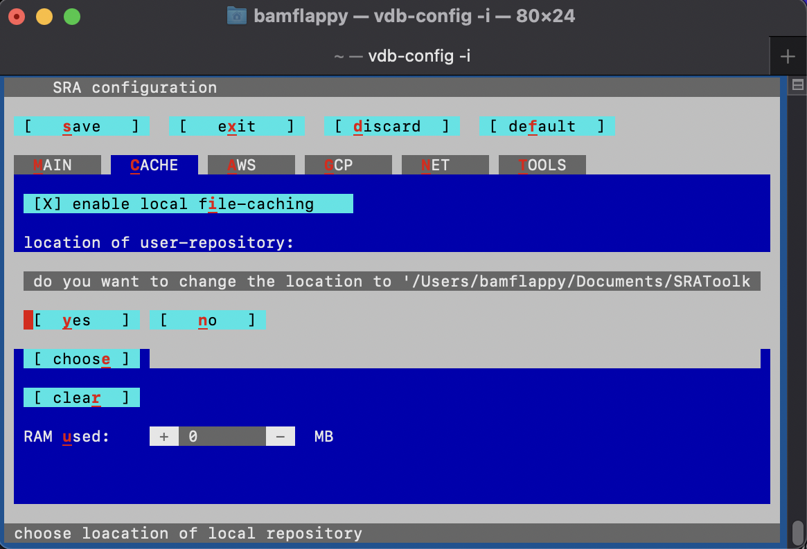
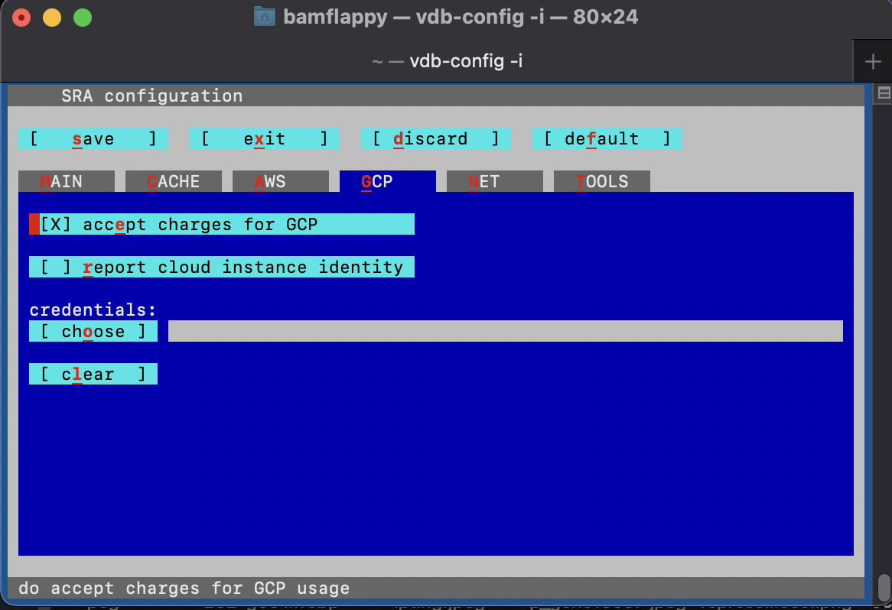
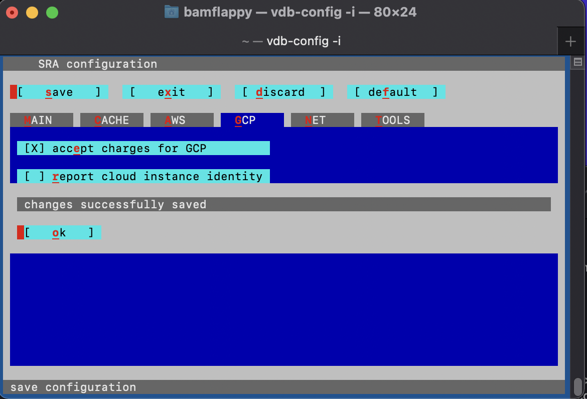

# Required Programming Language Software

These lessons require the installation of R, RStudio, and BASH. The R open-source software is an object-oriented programming language for statistical computing and graphics. It compiles and runs on a wide variety of UNIX platforms, Windows, 
and MacOS. 

RStudio is a set of integrated tools designed to help you be more productive with R. It includes a console, syntax-
highlighting editor that supports direct code execution, and a variety of robust tools for plotting, viewing history, debugging, and managing your workspace.

The command line terminal available to Mac OS and Linux is a powerful tool and where the magic happens. It’s excellent for software development, file management, remote analysis, and a myriad of other tasks.
 
## Windows Tips
1. To download R, visit [https://cran.r-project.org/](https://cran.r-project.org/) and at the top of the page, select the Windows operating system.
- Select the "Download R for Windows" link on the main page.
- Select the "base" link in the Subdirectories.
- Select the "Download R 4.1.2 for Windows" link, and the R installer will begin to download. 
- Open the installer and follow the instructions.

2. To download RStudio, visit [https://www.rstudio.com/products/rstudio/download/#download](https://www.rstudio.com/products/rstudio/download/#download) and follow the instructions to:
- “1. Install R”, which you have already done.
- “2. Download RStudio Desktop”
- Select the "Download RStudio for Windows" button and the R Studio installer will begin to download.
- Open the installer and follow the installation instructions.

3. The Ubuntu terminal for Windows has many of the same features you’ll find using the terminal on Ubuntu for Linux, visit [https://ubuntu.com/tutorials/ubuntu-on-windows#1-overview](https://ubuntu.com/tutorials/ubuntu-on-windows#1-overview). Note that you will need a x86 PC running Windows 10.
- As a first step the Windows Subsystem for Linux needs to be installed for your version of Windows 10.
- For Windows 10 systems updated to the Windows 10 Fall Creators update released October 2017, run the following in PowerShell as Administrator: 
> ~~~
> dism.exe /online /enable-feature /featurename:Microsoft-Windows-Subsystem-Linux /all /norestart
> ~~~
> {: .language-r}
- For Windows 10 systems updated to the Windows 10 May 2020 update and newer run the following in PowerShell as Administrator: 
> ~~~
> dism.exe /online /enable-feature /featurename:VirtualMachinePlatform /all /norestart
> ~~~
> {: .language-r}
- Then restart your computer.
- Now Ubuntu can be installed from the Microsoft Store:
  - Use the Start menu to launch the Microsoft Store application.
  - Search for Ubuntu and select the first result, "Ubuntu", published by Canonical Group Limited.
  - Click on the Install button. Ubuntu will be downloaded and installed automatically. Progress will be reported within the Microsoft Store application.
- Ubuntu can now be launched in the same way as any other Windows 10 application, such as searching for and selecting Ubuntu in the Start menu.
- When launched for the first time, Ubuntu will inform you that it’s "Installing" and you’ll need to wait a few moments. 
- Then enter a username and password specific to your Ubuntu installation, which don’t need to be the same as your Windows 10 credentials. With this step complete, you’ll find yourself at the Ubuntu bash command line.

## Mac OS Tips
1. To download R, visit [https://cran.r-project.org/](https://cran.r-project.org/) and at the top of the page, select the macOS operating system.
- Select the "Download R for macOS" link on the main page.
- Select the "base" link in the Subdirectories.
- Select the "R-4.1.2.pkg" link, and the R installer will begin to download. 
- Open the installer and follow the instructions.

2. To download RStudio, visit [https://www.rstudio.com/products/rstudio/download/#download](https://www.rstudio.com/products/rstudio/download/#download) and follow the instructions to:
- “1. Install R”, which you have already done.
- “2. Download RStudio Desktop”
- Select the "Download RStudio for Mac" button and the R Studio installer will begin to download.
- Open the installer and follow the installation instructions.

## Required Bioinformatics Software

In this workshop we will collect the transcriptomic data we need from the sequence read archive (SRA). Specifically, the transcript sequence data for the paper investigating the effects of UV-B exposure on the larvae of the red flour beetle.

To download the SRA toolkit:
1. navigate to the [installation instructions][installSRA]
2. find the appropriate instructions for your operating system (OS)
 
## Mac OS Tips
*Steps 1 & 2*
If you recieve an error when trying to use the *tar* command to unpack the downloaded software, try [adding the *-L* flag][flagFix] like so to the following *curl* command.
~~~
curl -L --output sratoolkit.tar.gz http://ftp-trace.ncbi.nlm.nih.gov/sra/sdk/current/sratoolkit.current-mac64.tar.gz
~~~
{: .language-bash}

Now you should be able to use the following *tar* command without error:
~~~
tar -vxzf sratoolkit.tar.gz
~~~
{: .language-bash}

*Steps 3 & 4*
If you do not recieve the expected similar output of "/Users/JoeUser/sratoolkit.2.4.0-1.mac64/bin/fastq-dump" from the *which fastq-dump* command, make sure that you use *ls* to check the name of the file unpacked by the previous *tar* command. For example:
~~~
ls
~~~
{: .language-bash}

This shows us the files in our current directory, including the following just unpacked file:
~~~
sratoolkit.2.11.2-mac64
~~~
{: .output}

So, this means we need to modify the command in the installation instructions as follows:
~~~
export PATH=$PATH:$PWD/sratoolkit.2.11.2-mac64/bin
~~~
{: .language-bash}

Now, when we run the *which fastq-dump* command we see the desired similar output:
~~~
/Users/bamflappy/sratoolkit.2.11.2-mac64/bin/fastq-dump
~~~
{: .output}

*Step 5*
Make sure to run the following configuration command and navigate through the [configuration interface][sraConfig] by proceeding through the instructions.
~~~
vdb-config -i
~~~
{: .language-bash}

This should bring up the following menu:
{: width="500" }
Where you should make sure to:
- enable (mark with X) the "Remote Access" option on the Main screen
- move to the "Cache" tab by clicking the tab and and pressing *enter*
  - enable "local file-caching"
  - set the "Location of user-repository" to an empty folder, which may be a new subdirectory that you can create using the configuration menu:
{: width="500" }
  - confirm the selected the direcory 
  {: width="500" }
- go to the "CP" (cloud provider) tab and accept to "report cloud instance identity"
{: width="500" }
- save your changes to the configuration of the SRA Toolkit software
{: width="500" }
- you may now exit the configuration menu

*Step 6*
Now you should be able to run the following command without error:
~~~
fastq-dump --stdout SRR390728 | head -n 8
~~~
{: .language-bash}

And recieve the following output:
~~~
@SRR390728.1 1 length=72
CATTCTTCACGTAGTTCTCGAGCCTTGGTTTTCAGCGATGGAGAATGACTTTGACAAGCTGAGAGAAGNTNC
+SRR390728.1 1 length=72
;;;;;;;;;;;;;;;;;;;;;;;;;;;9;;665142;;;;;;;;;;;;;;;;;;;;;;;;;;;;;96&&&&(
@SRR390728.2 2 length=72
AAGTAGGTCTCGTCTGTGTTTTCTACGAGCTTGTGTTCCAGCTGACCCACTCCCTGGGTGGGGGGACTGGGT
+SRR390728.2 2 length=72
;;;;;;;;;;;;;;;;;4;;;;3;393.1+4&&5&&;;;;;;;;;;;;;;;;;;;;;<9;<;;;;;464262
fastq-dump was killed (signal 13 SIGPIPE)
~~~
{: .output}
